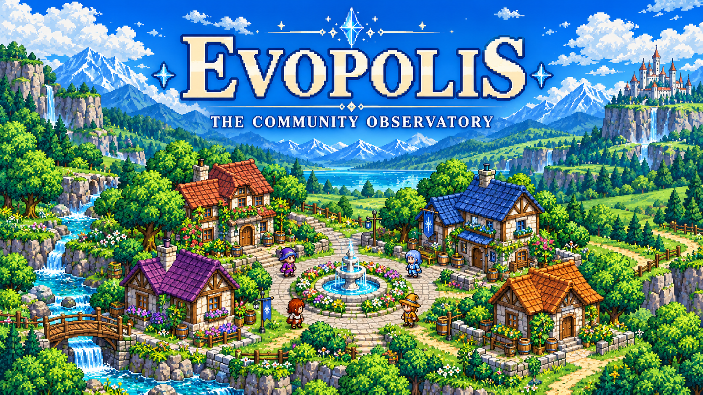
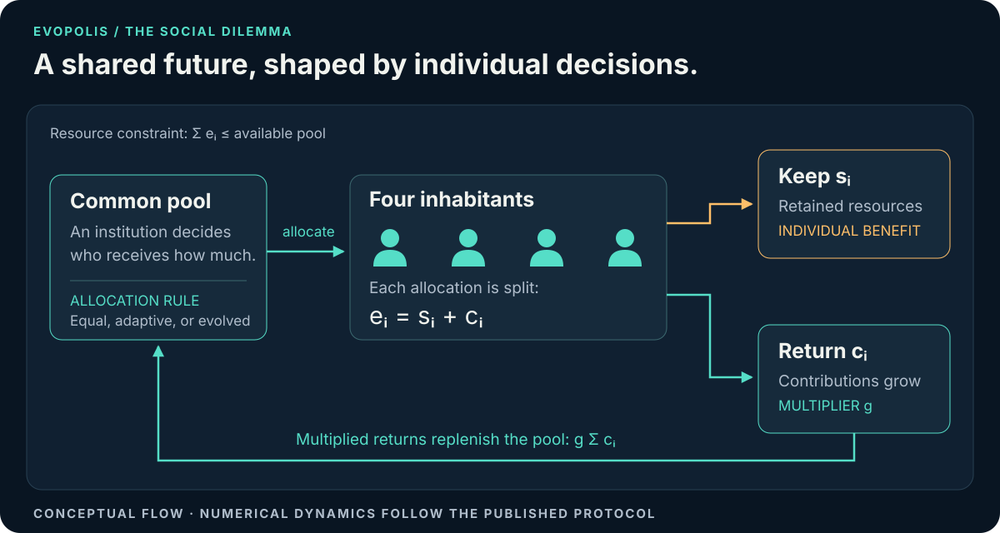
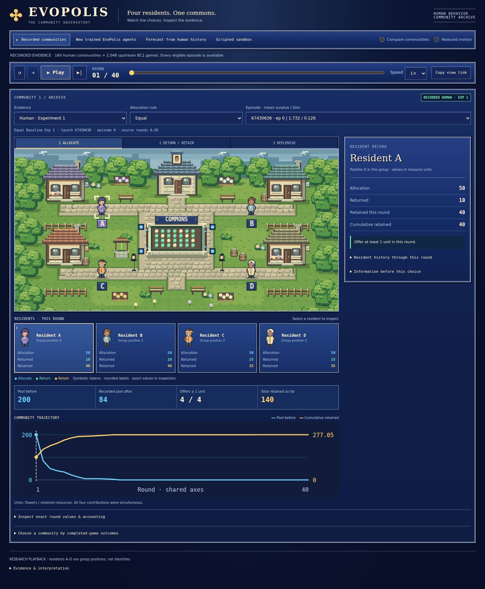
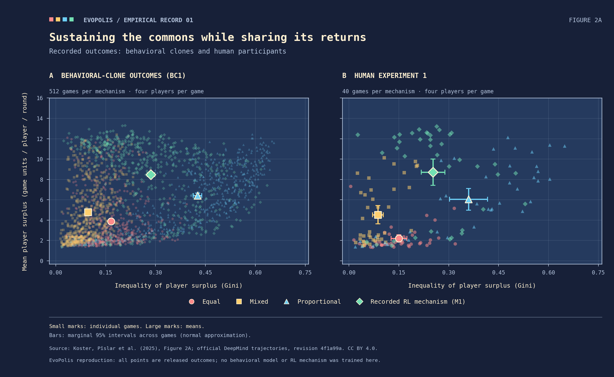
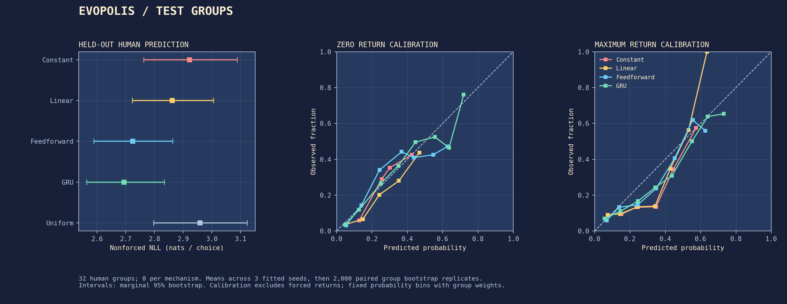
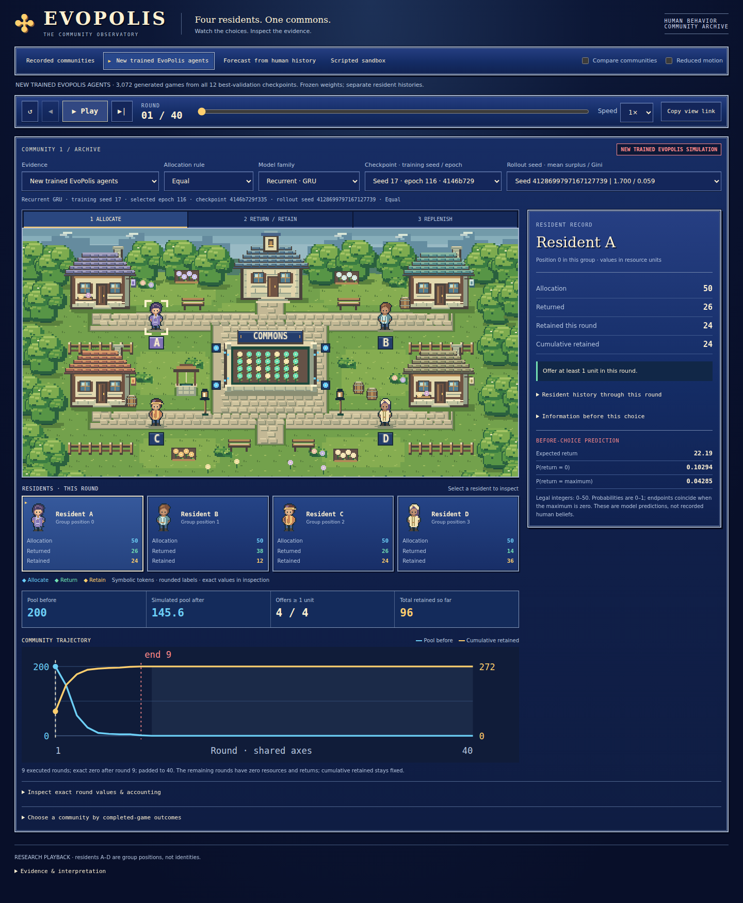
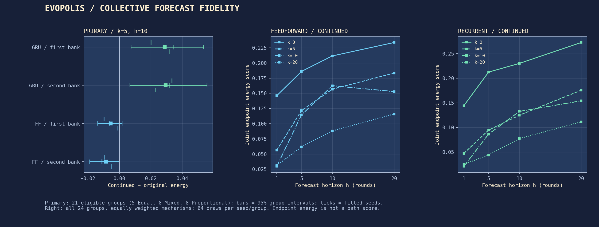
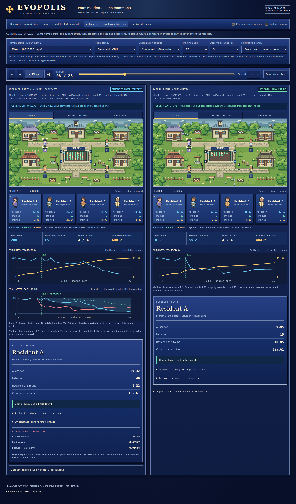
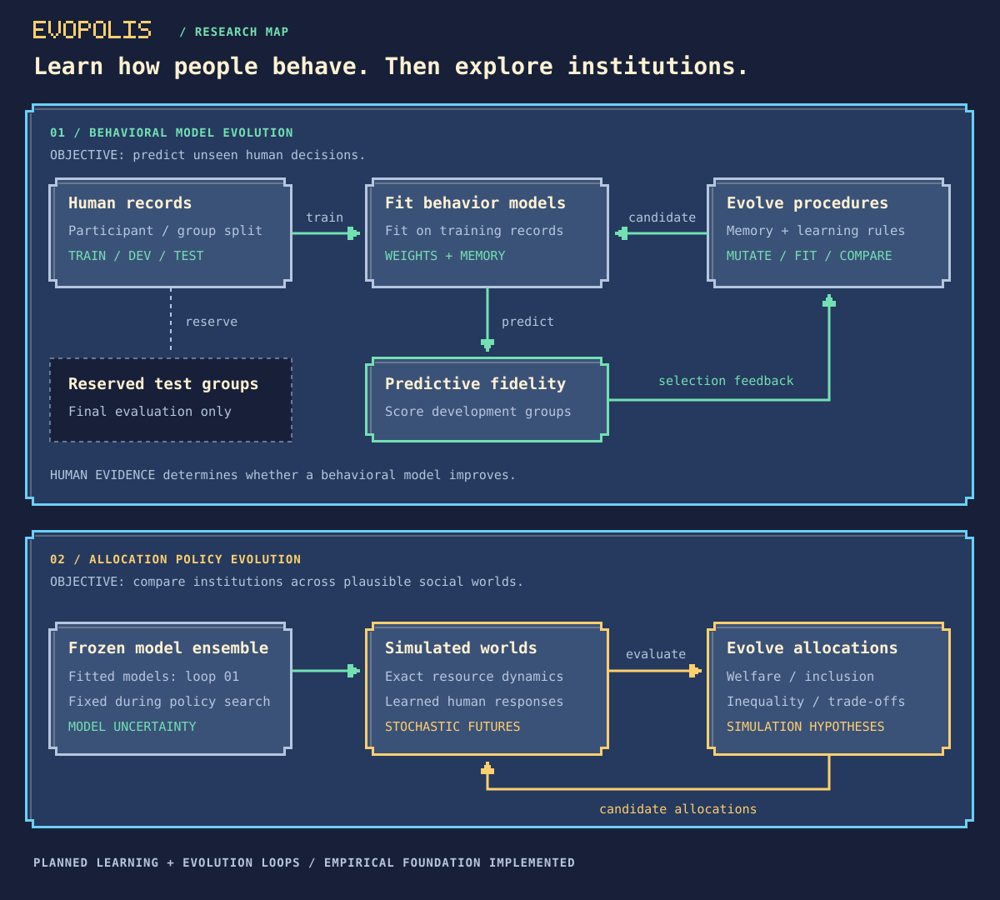

<p align="center">
  
</p>

<p align="center"><strong>Human behavior · Learned world models · Evolutionary computation</strong><br><sub>A living social laboratory with a 16-bit soul.</sub></p>
<p align="center"><a href="#the-research-question">Research question</a> · <a href="#the-first-world">The first world</a> · <a href="#research-program">Experiments</a> · <a href="#start-in-vs-code--wsl">Start in WSL</a> · <a href="#research-foundations">Foundations</a></p>

# EvoPolis

**Evolving social worlds to understand cooperation, institutions, and collective change.**

EvoPolis is a research project at the intersection of computational social science, agent-based simulation, learned world models, and evolutionary computation. Its aim is to build small, inspectable societies whose behavior is grounded in human decisions, then investigate how changing their institutions changes their collective future.

The first world is a community sharing a productive resource. Its inhabitants receive allocations, decide what to retain, and choose what to return to the commons. Their choices can sustain mutual prosperity, concentrate opportunities, or exhaust the resource on which everyone depends. The research follows two connected problems: learning a faithful model of those choices, and discovering institutions that work across plausible models of human behavior.

**Current state:** the empirical comparison is reproduced, behavioral agents are trained, and **150,912 conditional forecast branches have been evaluated against human Experiment 1**. Continuing six neural fits from 120 to 480 epochs improves individual prediction but worsens the declared primary GRU collective forecast. The 16-bit viewer exposes recorded communities, trained simulations and forecasts from observed human histories, with resident inspection and uncertainty bands. Experiments 2–3 remain reserved; evolutionary search remains planned. The cover is concept art; screenshots and figures below show working software and measured evidence.

## The research question

> Can evolutionary search improve a learned model of human cooperation—and do better social predictions support better institutional decisions?

This question separates **predictive fidelity** from **institutional performance**. A behavioral model earns its credibility by predicting human decisions it was not trained on. An allocation procedure is evaluated for what happens when it interacts with those models. A simulation that becomes more prosperous by making its inhabitants implausibly cooperative has not become a better model of society.

| Question | What would count as evidence? |
| :--- | :--- |
| Can the inhabitants reproduce human behavior? | Accurate response distributions and collective trajectories for held-out human groups. |
| Does evolutionary search improve the model? | Gains over a fixed learner and random search under comparable training budgets. |
| Do better predictions improve decisions? | Better policy performance across independently fitted models, with predictive and decision gains reported separately. |
| Which institutions sustain participation? | Joint analysis of individual outcomes, resource persistence, inequality, and exclusion. |
| Where does the model stop generalizing? | Explicit failures under new groups, unfamiliar allocations, and controlled changes to the environment. |

## The first world

The empirical foundation is **Koster, Pîslar et al. (2025)**, *Deep reinforcement learning can promote sustainable human behaviour in a common-pool resource problem*, published in **Nature Communications**. The study trained neural models of human decisions, developed resource-allocation mechanisms in simulation, and evaluated mechanisms with people. Its final dataset comprises 4,952 participants; the experimental unit is a group of four.

EvoPolis begins with that experimental unit and its published dynamics. The [official DeepMind release](https://github.com/google-deepmind/sustainable_behavior) provides an analysis notebook and recorded trajectories containing both human decisions and pre-generated behavioral-model rollouts. It does **not** release a complete simulator, training pipeline, or pretrained behavioral models. The paper's total participant count is not the size of an available model-training cohort. Our models are new fits to the released human trajectories; reproduced upstream model outcomes are labeled as recorded results.



Let the available resource at round $t$ be $R_t$. The institution allocates $e_{i,t}$ to inhabitant $i$, who returns $c_{i,t}$ and retains $s_{i,t}$:

$$
\sum_i e_{i,t}\le R_t,\qquad 0\le c_{i,t}\le e_{i,t},\qquad s_{i,t}=e_{i,t}-c_{i,t}.
$$

With capacity $R_{\max}$ and contribution multiplier $g$, the next resource stock is:

$$
R_{t+1}=\min\!\left(R_{\max},\;R_t-\sum_i e_{i,t}+g\sum_i c_{i,t}\right).
$$

The initial protocol uses four inhabitants, a pool capacity and initial stock of 200, and a contribution multiplier of 1.4. Experiments 1–3 run for 40 rounds, with the horizon undisclosed to participants. Human contributions advance in integer units, while allocations can be fractional. The [implemented protocol](docs/protocol.md) records timing, observable information, termination, and unresolved numerical conventions. Experiment 4 instead repeats three games within each group with a different continuation rule.

The working interface makes this mechanism visible as an original **Final Fantasy V-inspired pixel-art town**: lush scenery, detailed cottages, four resident sprites around a shared commons, and silver-edged blue menus. A party-style roster displays each resident's actual allocation, return, and retained resources; selecting a resident opens their history and available predictions. Recorded human decisions, upstream model outcomes, trained simulations, and forecasts have distinct source labels. Comparing communities does not change the original four-player group size.

### A 16-bit social laboratory

EvoPolis takes its visual direction from NES and SNES games of the late 1980s and early 1990s: expressive pixel inhabitants, tile-based scenery, square-framed menus, and a restrained palette of midnight blue, mint, cyan, amber, coral, and parchment. The cover, research diagrams, empirical figure, and working replay interface share this theme.

| Surface | Visual direction |
| :--- | :--- |
| Community | Original 2D town tiles, four distinct resident sprites, and a visible shared resource. |
| Decisions and histories | Dialogue-style panels showing allocations, contributions, private surplus, and past rounds. |
| Playback | Clear round counter and pause, step, and play controls; resource animations tied to actual actions. |
| Research diagrams | Crisp square borders, pixel symbols, and labeled directional flows. |
| Empirical figures | Matching colors and monospaced labels, with accurate positions, scales, and uncertainty intervals. |

The [visual style guide](docs/VISUAL_STYLE.md) and [reusable interface theme](docs/assets/evopolis-theme.css) keep future work consistent. Pixel art supplies the world and interface identity; empirical numbers, readable tables, and statistical meaning remain explicit.

### Watch a recorded community



This is a **real screenshot of the running application**, showing human Experiment 1, Equal allocation, launch `67430636`, episode `0`, at playback round 1. The default is the episode nearest its condition's median mean surplus, with ties resolved by the full episode key.

Play, pause, step or scrub through all **160 human episodes and 2,048 recorded BC1 episodes**. Select a resident to inspect allocations, returns, round surplus and cumulative retained resources. Exact source values remain available beneath the scene; charts and histories restore the selected round directly when seeking. An outcome scatter and episode menu expose every eligible game, and a copied view link preserves the selection and round.

In that default community, **playback round 12** (source `round_id=11`) offers each resident **0.699999988079071** units. All four return zero. The recorded pool after the round is **0.009999999776482582**, and the release retains all 40 rounds. This makes the integer contribution constraint and documented residual pool visible; it is one identified episode, not a new estimate of a treatment effect.

Comparison mode places two independently selected episodes on the same playback clock. These are different observed groups, not the same people under alternative institutions. The separate **scripted sandbox** assigns each resident an editable fraction `q`, returns `floor(q × allocation)`, and runs Equal, Proportional, Mixed or Interpolating allocation using the Python environment. Settings edits begin a new run. These fixed scripts are neither trained agents nor predictions of human behavior.

The [viewer guide](docs/viewer.md) explains controls, source semantics, and limitations. In particular, the final BC1 next-pool value is unavailable; observed trajectories preserve the source's residuals, while scripted runs stop at exact zero or 40 rounds. The trained-agent source described below now adds newly generated behavior without modifying recorded episodes.

## First empirical result: surplus and inequality

Equal allocation gives everyone access to the commons, but does not condition future access on contributions. Proportional allocation rewards contributions, yet a player who returns nothing can lose all future access. This makes sustaining the resource and sharing its returns distinct challenges.

The reproduction of **Figure 2A** compares these rules, their equal/proportional mixture, and the study's recorded RL mechanism M1. The left panel contains **512 recorded BC1 games per mechanism**; the right contains **40 human groups per mechanism**. Every game has four players and 40 logged rounds, including depleted rounds. Small marks are games; large marks average their surplus and Gini coordinates.



Human Experiment 1 results, in game units retained per player per round:

| Allocation mechanism | Groups | Mean surplus | Mean Gini |
| :--- | ---: | ---: | ---: |
| Equal | 40 | 2.202 | 0.150 |
| Mixed | 40 | 4.533 | 0.087 |
| Proportional | 40 | 6.047 | 0.360 |
| Recorded RL mechanism M1 | 40 | **8.718** | **0.253** |

The recorded RL mechanism yields **44.2% more surplus than proportional allocation**, with lower inequality (surplus rank-sum \|z\| = 3.252, p = 0.00114; Gini \|z\| = 2.781, p = 0.00542). Its inequality remains higher than under equal or mixed allocation. All ten human rank-sum statistics reported in the paper's Figure 2A discussion agree to the published two decimal places. The data imply 144.2% **of** proportional surplus; the paper's wording “150% greater” is not supported literally by these means.

Gini is computed across each game's four players' mean surplus, then averaged across games. Figure bars add marginal 95% intervals using the notebook's normal-approximation helper, with games as the replication unit. They were not shown in the original figure. See the [complete numerical table and intervals](results/task01/figure2a_table.md), [editable SVG](docs/assets/figure2a.svg), [plotting code](evopolis/plotting.py), and [independent numerical audit](docs/figure-audit.md).

**What this establishes.** The released human and BC1 outcomes reproduce the published comparison. EvoPolis newly implements the resource equation and equal, proportional, mixed, and interpolating baselines; it has not trained BC1, recreated the upstream RL network, or generated the plotted outcomes. The CSV contains **24,422 human** and **143,360 synthetic** round records. It does not identify the original BC1 training cohort, and it lacks participant identifiers that could link people across separate groups.

**Numerical limit.** The published equation is executable, but the unreleased simulator is not exactly reconstructed. Auditing all 167,782 records finds pool-transition residuals, including an apparent 0.01-unit floor in depleted games and smaller precision effects. Affected records and tolerances are preserved in the [replay audit](docs/protocol.md#what-the-recorded-transitions-actually-show), rather than silently corrected. These discrepancies do not alter Figure 2A, which uses the recorded player rewards. This reproduction is descriptive evidence from the released evaluation games, not a held-out test of a new behavioral model.

## First trained inhabitants: prediction before prosperity

Task 03 fits Constant, Linear, Feedforward and Recurrent GRU response distributions, each with three training seeds and 120 epochs. All use the same nine pre-decision inputs and legal integer support. Human Experiment 1 supplies **96 training, 32 validation and 32 test groups**, split by complete interacting group and mechanism. The primary score excludes mechanically forced zeros: the test contains **2,439 nonforced choices**, with choices averaged within groups and mechanisms weighted equally.

| Predictor | Test NLL, nats per nonforced choice ↓ | Mean absolute error, units ↓ |
| :--- | ---: | ---: |
| Uniform, unfitted | 2.959 | 10.064 |
| Constant | 2.922 | 8.697 |
| Linear | 2.862 | 6.442 |
| Feedforward, 4,285 parameters | 2.724 | 5.642 |
| GRU, 4,293 parameters | **2.694** | **5.529** |

The models learned useful conditional response distributions: mean GRU validation NLL fell from **3.408 at initialization to 2.649 after fitting**. But **additional recurrent memory has no clear demonstrated advantage**. GRU minus feedforward test NLL is **−0.029**, with a paired 95% group-bootstrap interval of **[−0.064, +0.006]**. The feedforward control already receives previous contributions. Three optimization seeds are averaged within each group before 2,000 paired, mechanism-stratified bootstrap draws; they are not additional human replications.



Calibration remains imperfect: the GRU predicts maximum-feasible returns **19.43%** of the time versus **16.18%** observed under the declared group weights. All checkpoints, [actual learning curves](docs/assets/task03-learning-curves.png), [per-group metrics](results/task03/prediction_groups.csv), [seed/mechanism results and uncertainty](results/task03/prediction_summary.json), and [the full experiment report](docs/behavioral-agents.md) are available. These are new EvoPolis fits, not recreated upstream BC1 networks. Test groups were held out from this fitting and selection, but Task 01 had already described them; their published outcomes cannot be pristine confirmation for later searches.

### Watch learned choices become a community



Launch `bash scripts/viewer.sh --port 8765`, then open **http://127.0.0.1:8765/?mode=trained**. Select **New trained EvoPolis agents** to choose any family, checkpoint, allocation rule and rollout seed. Playback shows saved pre-choice expected returns and endpoint probabilities beside actual sampled actions. Comparison panes use common rounds and shared numerical scales; post-termination padding is marked explicitly. Recorded humans, upstream models and fixed scripts remain distinct sources.

Every best-validation checkpoint generates 64 games under each of Equal, Proportional, Mixed and Interpolating: **3,072 games, with none filtered for success**. Weights remain frozen while each GRU resident updates its own memory. The default is the median-surplus Equal game for predeclared training seed 17: rollout **4128699797167127739**, checkpoint epoch **116**. Its first-round expected return is **22.188** from an offer of 50; the four independent samples are **26, 38, 26 and 14**. It reaches exact zero after round 9.

The [generated outcome distributions](docs/assets/trained-outcomes.png) and [pool/participation trajectories](docs/assets/trained-trajectories.png) expose a substantial gap. GRU mean surplus under Equal/Mixed/Proportional is **2.013/2.178/3.563**, compared with **1.788/5.594/6.756** in the corresponding held-out human groups. All generated summaries use the same 40-round denominator, including zero padding. Human records retain their approximately 0.01 residual pool; the reconstructed simulation does not add that floor. Interpolating is exploratory transfer with no Experiment 1 human counterpart. Predictive learning has occurred; reliable counterfactual social simulation has not been established.

## More training improves choices, but can worsen collective forecasts

Task 04 continued all six neural fits from their **epoch-120 optimizer and random states through epoch 480**, preserving the data split, architecture and training objective. Checkpoints were selected only by validation likelihood across all 480 epochs. The experiment evaluates eighteen original/continued checkpoint conditions through **150,912 forecast branches**, starting after 0, 5, 10 or 20 observed rounds. Recorded current allocations start each forecast; later choices, allocations and pools are generated without future human information.

| Prediction | Original budget | Continued budget | Paired change, 95% group interval |
| :--- | ---: | ---: | :--- |
| Feedforward individual NLL, 32 groups ↓ | 2.7238 | 2.6890 | −0.0347 [−0.0528, −0.0170] |
| GRU individual NLL, 32 groups ↓ | 2.6944 | 2.6189 | −0.0755 [−0.1071, −0.0400] |
| **GRU primary collective energy score ↓** | **0.09660** | **0.12538** | **+0.02878 [+0.00747, +0.05352]** |
| Feedforward collective energy, secondary ↓ | 0.16271 | 0.15708 | −0.00563 [−0.01385, +0.00172] |

The primary forecast predicts the joint pool/surplus endpoint **ten rounds after five observed rounds**, using 21 origin-eligible groups: five Equal, eight Mixed and eight Proportional. Individual gains also hold on the matched 24 baseline groups, excluding recorded M1. Scores are computed separately for every fitted seed, averaged within each human group, then equally across mechanisms. Branches and training seeds are not additional human replications. This follow-up reuses already opened Experiment 1 evidence.



The independent second bank reproduces GRU deterioration: **+0.02944 [+0.00663, +0.05570]**. Feedforward's small collective gain remains uncertain in the primary bank. The canonical-first-allocation sensitivity shifts the GRU budget effect by only **+0.00019**; no legal maximum changes at these particular origins, so this does not rule out every numerical convention. All original Task 03 artifacts remain unchanged.

The evidence supports investigating **misspecified collective responses under observed histories, and how those errors compound through resource feedback**. For Mixed allocation, continued GRU renewal probability falls from **36.02% to 27.57%**, against **36.84% observed**, despite improved individual likelihood. Persistent individual differences, residual dependence between residents, and the marginal response distribution are candidates to distinguish next. This experiment identifies a prediction failure, not its unique psychological cause. Some other origins/horizons improve; neither endpoint energy nor mean marginal trajectory error validates full path dependence or new institutions. Experiments 2–3 remain reserved for a separate transfer protocol.

### Inspect a forecast from human history



Launch `bash scripts/viewer.sh --port 8765`, then open **http://127.0.0.1:8765/?mode=forecast**. Select any of the 24 groups, model/budget, training seed and origin. Playback distinguishes the observed prefix, generated choices, actual future and post-termination padding; resident predictions and pointwise 80% forecast bands retain real values on shared axes.

The default is Mixed human launch **18823620**, continued GRU seed **17**, selected epoch **476**, origin **k=5**, branch **0**. At the first forecast decision, its inhabitants return **30/0/44/47**, while the actual humans returned **35/31/5/3**. The predicted branch leaves a pool of **169.4011**, versus **103.6011** recorded. This branch is an illustration of the saved distribution, not a fitted typical person or the score itself.

The [full report](docs/collective-forecast-fidelity.md) includes [learning and individual prediction](docs/assets/task04-optimization.png), [observed/forecast trajectories](docs/assets/task04-forecast-trajectories.png), [renewal calibration](docs/assets/task04-renewal-calibration.png), all proper scores, eligibility counts, numerical sensitivity and reproduction commands. The [independent audit](results/task04/independent_score_audit.json) reconstructs primary scores and intervals from saved draws, with maximum disagreement **2.22×10⁻¹⁶**.

## What learns—and what evolves

The first learned world model combines **known resource accounting** with **learned, probabilistic human responses**. The accounting determines what is materially possible; the behavioral model estimates how inhabitants respond to their experience and the institution's allocations.

| Component | Learning or search target | Evidence used |
| :--- | :--- | :--- |
| Behavioral agent | Parameters mapping available information and history to a distribution over contributions. | Recorded human decisions. |
| Agent memory | A state summarizing previous rounds. A recurrent state update is distinct from online weight training. | The information available to the original participant. |
| Social world model | Distributions over individual responses and resulting collective trajectories. | Human trajectories under observed mechanisms. |
| Evolutionary model search | Compact memory-update and history-feature programs; each candidate is fitted under the same data and compute rules. | Development-set prediction; untouched groups reserved for final evaluation. |
| Evolutionary institution search | Executable allocation procedures satisfying the world's resource constraints. | Outcomes across a frozen ensemble of behavioral models. |

Training must produce saved parameters and measurable changes in predictive performance. Evolution must produce identifiable candidate procedures and an interpretable comparison with simpler alternatives. Natural-language memory or integration with an optimizer alone will not establish either result.



### Evolutionary computation, artificial life, and self-improvement

**Evolutionary computation** supplies the initial search method: maintain alternative candidate procedures, vary them, evaluate them, and retain useful descendants. The first target is how the model remembers and summarizes experience. Institutional search is a separate experiment with a different objective.

**Artificial life** becomes a later extension through interacting communities, strategy transmission, entry and exit, and feedback between social organization and shared resources. These mechanisms will be introduced individually so that their consequences remain interpretable.

**Automated self-improvement** is a longer-term research direction. The system may propose changes to its own learning procedure and evaluate whether those changes improve subsequent learning. A claim of recursive self-improvement would require evidence of improved improvement capability on fresh tasks at matched budgets. Ordinary evolutionary optimization does not establish that claim.

## Research program

The repository develops cumulatively. Each stage should yield a scientific object worth examining: an empirical reproduction, trained model, population of candidate procedures, or comparison of social outcomes.

| Stage | Experiment | Main artifact | Status |
| :--- | :--- | :--- | :--- |
| **01 · Ground** | Reconstruct the published task and reproduce a substantive result from the released human data. | Empirical figure, numerical comparison, and executable resource dynamics, with numerical ambiguities documented. | **Complete** |
| **02 · Observe** | Visualize recorded communities and baseline simulations. | Verified local pixel-art replay, resident inspection, comparisons, and scripted sandbox. | **Complete** |
| **03 · Learn** | Fit simple behavioral baselines and a compact recurrent agent. | Twelve trained checkpoints, measured human predictions, 3,072 generated games and verified trained-agent playback. | **Complete** |
| **04 · Imagine** | Assess multi-round forecasts across allocation rules and optimization budgets. | Completed fourfold optimization control, 150,912 conditional forecasts, numerical sensitivity and working forecast inspection. New-cohort transfer remains a later test. | **Complete** |
| **05 · Evolve** | Search memory and history-processing procedures. | Candidate lineage and comparison with fixed and random-search baselines. | Planned |
| **06 · Govern** | Evolve allocation procedures across frozen behavioral models. | Trade-offs among surplus, inclusion, inequality, and resource persistence. | Planned |
| **07 · Expand** | Introduce one mechanism such as communication, community switching, or resource shocks. | A controlled study of changed assumptions. | Planned |
| **08 · Improve** | Test changes to the procedure that trains or improves the models. | Fresh-task evidence about subsequent learning capability. | Future research |

### How experiments will be judged

| Dimension | Planned measurement | Comparison that matters |
| :--- | :--- | :--- |
| Individual prediction | Held-out log likelihood, prediction error, and distributional calibration. | Conditional-cooperation and compact statistical/neural baselines. |
| Collective dynamics | Contributions, resource trajectories, depletion, and inclusion over rounds. | Recorded human groups under the same mechanisms. |
| Evolutionary benefit | Predictive improvement at a matched search/training budget. | Fixed procedure and random search. |
| Institutional outcomes | Aggregate retained surplus, its distribution, exclusion, and resource persistence. | Published implementable allocation baselines. |
| Robustness | Variation across fitted behavioral models, seeds, and new experimental conditions. | Performance on unfamiliar groups and stress scenarios. |
| Computational cost | Training time, peak memory, evaluations, and any external model calls. | Gains obtained for the same practical resource budget. |

Human participants and interacting groups define the split boundaries. Repeated observations from the same participant or group must not leak between training, selection, and final evaluation. Statistical uncertainty must reflect those dependencies. Behavioral fitting and evolutionary selection use development evidence; the final human test set remains untouched until the selected procedure is frozen.

New institutions may induce behavior outside the support of the recorded data. Cross-model evaluation helps expose simulator exploitation, but agreement between models does not establish a real-world causal effect. Novel policy outcomes will be reported as simulation findings until supported by new human evidence. Synthetic experiments on larger communities or shocks will be labeled as extensions.

## Start in VS Code / WSL

Run these commands in your **WSL terminal**, with Git and the VS Code WSL extension available. They create a new checkout under the Linux filesystem:

```bash
mkdir -p ~/projects
cd ~/projects
git clone https://github.com/ReloadLightly/evopolis.git
code --new-window evopolis
```

If you already cloned the repository, open that checkout instead. With [uv](https://docs.astral.sh/uv/getting-started/installation/) available, launch the community viewer:

```bash
bash scripts/viewer.sh --port 8765
```

Open **http://127.0.0.1:8765** and stop the server with Ctrl+C. The command uses the locked Python environment and prepares a compact, verified replay cache on first use. Playback works offline after preparation. No frontend build, model API, GPU, or external database service is needed. See [the viewer guide](docs/viewer.md) for alternate ports and verification.

To reproduce the empirical inventory, accounting audit, tables and figures separately:

```bash
bash scripts/reproduce.sh
```

The analysis command streams the public 204 MiB CSV into ignored `data/raw/` on first use. It verifies the pinned data and notebook checksums, then writes `results/task01/` and PNG/SVG figures in `docs/assets/`. Subsequent runs use cached sources. The [Task 01 notes](docs/tasks/01-empirical-foundation.md#completion-record) record its runtime, memory, verification, and dependencies; the [data inventory](docs/data-inventory.md) describes schema, missing values, and group identity limits.

To prepare and run or resume the fixed behavioral experiment:

```bash
bash scripts/learn.sh prepare
bash scripts/learn.sh benchmark
bash scripts/learn.sh train
bash scripts/learn.sh evaluate
bash scripts/learn.sh generate
bash scripts/learn.sh verify
bash scripts/learn.sh plot
```

The CPU-only PyTorch dependency is pinned; training uses one compute thread and saves resumable checkpoints. Published weights and generated trajectories are already included, so watching the inhabitants does not require retraining. [The Task 03 guide](docs/behavioral-agents.md) explains its split and original budget. [The Task 04 report](docs/collective-forecast-fidelity.md#reproduce-and-inspect) gives the complete continuation/forecast sequence through `scripts/forecast.sh`, including measured memory, checkpointing and evaluation rules. Numerical jobs run sequentially. No evolutionary search or online weight adaptation was performed; the next scientific work is a targeted explanation of the measured collective-prediction failure.

## Research foundations

| Source | Contribution to EvoPolis |
| :--- | :--- |
| [Koster, Pîslar et al. (2025), Nature Communications](https://doi.org/10.1038/s41467-025-58043-7) · [code and data access](https://github.com/google-deepmind/sustainable_behavior) | The initial human experiment, behavioral-modeling approach, and institution-design problem. |
| [Liang, *Simulation: The Next Frontier for AI*](https://www.simile.com/blog/simulation-next-frontier) | The broader motivation: faithful people and environments, efficient simulation, and calibrated outcomes. |
| [Park et al. (2023), *Generative Agents*](https://arxiv.org/abs/2304.03442) · [implementation](https://github.com/joonspk-research/generative_agents) | Inspiration for inspectable inhabitants, experience, and social interaction. |
| [StanfordHCI/genagents](https://github.com/StanfordHCI/genagents) | A possible later source of memory and language-interaction components. |
| [Mesa](https://mesa.readthedocs.io/stable/) | A candidate framework for agent management and browser visualization. |

The initial upstream reference is pinned to [`4f1a99a`](https://github.com/google-deepmind/sustainable_behavior/tree/4f1a99a9d150f9fa6bad1a0f70f11c0673d46763). Adapted upstream software retains its Apache-2.0 notices; other released upstream materials are covered by CC BY 4.0. See [source and asset notes](docs/SOURCES.md) for provenance. EvoPolis is an independent project, with no affiliation implied by its research references.

---

**EvoPolis studies how individual experience, social interaction, and institutional rules combine to shape collective futures.**
