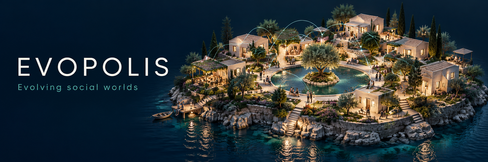

<p align="center">
  
</p>

<p align="center"><strong>Human behavior · Learned world models · Evolutionary computation</strong></p>
<p align="center"><a href="#the-research-question">Research question</a> · <a href="#the-first-world">The first world</a> · <a href="#research-program">Experiments</a> · <a href="#start-in-vs-code--wsl">Start in WSL</a> · <a href="#research-foundations">Foundations</a></p>

# EvoPolis

**Evolving social worlds to understand cooperation, institutions, and collective change.**

EvoPolis is a research project at the intersection of computational social science, agent-based simulation, learned world models, and evolutionary computation. Its aim is to build small, inspectable societies whose behavior is grounded in human decisions, then investigate how changing their institutions changes their collective future.

The first world is a community sharing a productive resource. Its inhabitants receive allocations, decide what to retain, and choose what to return to the commons. Their choices can sustain mutual prosperity, concentrate opportunities, or exhaust the resource on which everyone depends. The research follows two connected problems: learning a faithful model of those choices, and discovering institutions that work across plausible models of human behavior.

**Current state:** research design, visual identity, and the first implementation task. The simulation, trained models, and experimental results are planned. The cover is conceptual artwork; the diagrams below describe the proposed system.

## The research question

> Can evolutionary search improve a learned model of human cooperation—and do better social predictions support better institutional decisions?

This question separates **predictive fidelity** from **institutional performance**. A behavioral model earns its credibility by predicting human decisions it was not trained on. An allocation procedure is evaluated for what happens when it interacts with those models. A simulation that becomes more prosperous by making its inhabitants implausibly cooperative has not become a better model of society.

| Question | What would count as evidence? |
| :--- | :--- |
| Can the inhabitants reproduce human behavior? | Accurate response distributions and collective trajectories for held-out human groups. |
| Does evolutionary search improve the model? | Gains over a fixed learner and random search under comparable training budgets. |
| Do better predictions improve decisions? | Better policy performance across independently fitted models, with predictive and decision gains reported separately. |
| Which institutions sustain participation? | Joint analysis of individual outcomes, resource persistence, inequality, and exclusion. |
| Where does the model stop generalizing? | Explicit failures under new groups, unfamiliar allocations, and controlled changes to the environment. |

## The first world

The empirical foundation is **Koster, Pîslar et al. (2025)**, *Deep reinforcement learning can promote sustainable human behaviour in a common-pool resource problem*, published in **Nature Communications**. The study trained neural models of human decisions, developed resource-allocation mechanisms in simulation, and evaluated mechanisms with people. Its final dataset comprises 4,952 participants; the experimental unit is a group of four.

EvoPolis begins with that experimental unit and its published dynamics. The [official DeepMind release](https://github.com/google-deepmind/sustainable_behavior) provides an analysis notebook and recorded trajectories containing both human decisions and pre-generated behavioral-model rollouts. It does **not** release a complete simulator, training pipeline, or pretrained behavioral models. The paper's total participant count is not the size of an available model-training cohort. Our models will be new fits to the released human trajectories; reproduced upstream model outcomes will be labeled as recorded results.


Let the available resource at round $t$ be $R_t$. The institution allocates $e_{i,t}$ to inhabitant $i$, who returns $c_{i,t}$ and retains $s_{i,t}$:

$$
\sum_i e_{i,t}\le R_t,\qquad 0\le c_{i,t}\le e_{i,t},\qquad s_{i,t}=e_{i,t}-c_{i,t}.
$$

With capacity $R_{\max}$ and contribution multiplier $g$, the next resource stock is:

$$
R_{t+1}=\min\!\left(R_{\max},\;R_t-\sum_i e_{i,t}+g\sum_i c_{i,t}\right).
$$

The initial protocol uses four inhabitants, a pool capacity and initial stock of 200, and a contribution multiplier of 1.4. Experiments 1–3 run for 40 rounds, with the horizon undisclosed to participants. The first implementation will also transcribe the paper's information, allocation bounds, rounding, and termination rules before running extensions. These details determine what an agent can know and which decisions are feasible.

The planned interface will make this mechanism visible: inhabitants around a shared commons, resource flows, individual histories, and synchronized comparisons between institutions. Replaying observed human decisions and running generated futures will be distinct display modes. Several independent communities can be compared without changing the original group size.

## What learns—and what evolves

The first learned world model combines **known resource accounting** with **learned, probabilistic human responses**. The accounting determines what is materially possible; the behavioral model estimates how inhabitants respond to their experience and the institution's allocations.

| Component | Learning or search target | Evidence used |
| :--- | :--- | :--- |
| Behavioral agent | Parameters mapping available information and history to a distribution over contributions. | Recorded human decisions. |
| Agent memory | A state summarizing previous rounds. A recurrent state update is distinct from online weight training. | The information available to the original participant. |
| Social world model | Distributions over individual responses and resulting collective trajectories. | Human trajectories under observed mechanisms. |
| Evolutionary model search | Compact memory-update and history-feature programs; each candidate is fitted under the same data and compute rules. | Development-set prediction; untouched groups reserved for final evaluation. |
| Evolutionary institution search | Executable allocation procedures satisfying the world's resource constraints. | Outcomes across a frozen ensemble of behavioral models. |

Training must produce saved parameters and measurable changes in predictive performance. Evolution must produce identifiable candidate procedures and an interpretable comparison with simpler alternatives. Natural-language memory or integration with an optimizer alone will not establish either result.


### Evolutionary computation, artificial life, and self-improvement

**Evolutionary computation** supplies the initial search method: maintain alternative candidate procedures, vary them, evaluate them, and retain useful descendants. The first target is how the model remembers and summarizes experience. Institutional search is a separate experiment with a different objective.

**Artificial life** becomes a later extension through interacting communities, strategy transmission, entry and exit, and feedback between social organization and shared resources. These mechanisms will be introduced individually so that their consequences remain interpretable.

**Automated self-improvement** is a longer-term research direction. The system may propose changes to its own learning procedure and evaluate whether those changes improve subsequent learning. A claim of recursive self-improvement would require evidence of improved improvement capability on fresh tasks at matched budgets. Ordinary evolutionary optimization does not establish that claim.

## Research program

The repository develops cumulatively. Each stage should yield a scientific object worth examining: an empirical reproduction, trained model, population of candidate procedures, or comparison of social outcomes.

| Stage | Experiment | Main artifact | Status |
| :--- | :--- | :--- | :--- |
| **01 · Ground** | Reconstruct the published task and reproduce a substantive result from the released human data. | Empirical figure, numerical comparison, and executable resource dynamics. | **Next** |
| **02 · Observe** | Visualize recorded communities and baseline simulations. | Local browser replay with resource flows and individual histories. | Planned |
| **03 · Learn** | Fit simple behavioral baselines and a compact recurrent agent. | Model checkpoints, learning curves, and predictions for held-out groups. | Planned |
| **04 · Imagine** | Generate multi-round social trajectories under recorded institutions. | Calibration, trajectory comparisons, and uncertainty estimates. | Planned |
| **05 · Evolve** | Search memory and history-processing procedures. | Candidate lineage and comparison with fixed and random-search baselines. | Planned |
| **06 · Govern** | Evolve allocation procedures across frozen behavioral models. | Trade-offs among surplus, inclusion, inequality, and resource persistence. | Planned |
| **07 · Expand** | Introduce one mechanism such as communication, community switching, or resource shocks. | A controlled study of changed assumptions. | Planned |
| **08 · Improve** | Test changes to the procedure that trains or improves the models. | Fresh-task evidence about subsequent learning capability. | Future research |

### How experiments will be judged

| Dimension | Planned measurement | Comparison that matters |
| :--- | :--- | :--- |
| Individual prediction | Held-out log likelihood, prediction error, and distributional calibration. | Conditional-cooperation and compact statistical/neural baselines. |
| Collective dynamics | Contributions, resource trajectories, depletion, and inclusion over rounds. | Recorded human groups under the same mechanisms. |
| Evolutionary benefit | Predictive improvement at a matched search/training budget. | Fixed procedure and random search. |
| Institutional outcomes | Aggregate retained surplus, its distribution, exclusion, and resource persistence. | Published implementable allocation baselines. |
| Robustness | Variation across fitted behavioral models, seeds, and new experimental conditions. | Performance on unfamiliar groups and stress scenarios. |
| Computational cost | Training time, peak memory, evaluations, and any external model calls. | Gains obtained for the same practical resource budget. |

Human participants and interacting groups define the split boundaries. Repeated observations from the same participant or group must not leak between training, selection, and final evaluation. Statistical uncertainty must reflect those dependencies. Behavioral fitting and evolutionary selection use development evidence; the final human test set remains untouched until the selected procedure is frozen.

New institutions may induce behavior outside the support of the recorded data. Cross-model evaluation helps expose simulator exploitation, but agreement between models does not establish a real-world causal effect. Novel policy outcomes will be reported as simulation findings until supported by new human evidence. Synthetic experiments on larger communities or shocks will be labeled as extensions.

## Start in VS Code / WSL

Run these commands in your **WSL terminal**, with Git and the VS Code WSL extension available. They create a new checkout under the Linux filesystem:

```bash
mkdir -p ~/projects
cd ~/projects
git clone https://github.com/ReloadLightly/evopolis.git
code --new-window evopolis
```

If you already cloned the repository, open that checkout instead. The simulation has not been implemented yet, so there is no training or dashboard command to run at this stage.

Open Codex in that VS Code window and give it this first task:

```text
Read AGENTS.md, README.md, and docs/tasks/01-empirical-foundation.md.
Complete Task 01 in this repository: reconstruct the published common-pool
experiment and reproduce its first substantive empirical figure.
Follow the task's scope, run the analysis, update the README with the actual
findings and figures, and commit and push the completed work to origin.
```

The full brief is in **[Task 01: empirical foundation](docs/tasks/01-empirical-foundation.md)**. Subsequent tasks will be specified from the preceding results. The intended stack is Python with compact CPU-oriented models, a numerical simulation core, and a local browser visualization. Hardware and data will be profiled before selecting training budgets. Large language models are optional for later communication or program proposals; routine simulation will not depend on a model API call for every inhabitant and round.

## Research foundations

| Source | Contribution to EvoPolis |
| :--- | :--- |
| [Koster, Pîslar et al. (2025), Nature Communications](https://doi.org/10.1038/s41467-025-58043-7) · [code and data access](https://github.com/google-deepmind/sustainable_behavior) | The initial human experiment, behavioral-modeling approach, and institution-design problem. |
| [Liang, *Simulation: The Next Frontier for AI*](https://www.simile.com/blog/simulation-next-frontier) | The broader motivation: faithful people and environments, efficient simulation, and calibrated outcomes. |
| [Park et al. (2023), *Generative Agents*](https://arxiv.org/abs/2304.03442) · [implementation](https://github.com/joonspk-research/generative_agents) | Inspiration for inspectable inhabitants, experience, and social interaction. |
| [StanfordHCI/genagents](https://github.com/StanfordHCI/genagents) | A possible later source of memory and language-interaction components. |
| [Mesa](https://mesa.readthedocs.io/stable/) | A candidate framework for agent management and browser visualization. |

The initial upstream reference is pinned to [`4f1a99a`](https://github.com/google-deepmind/sustainable_behavior/tree/4f1a99a9d150f9fa6bad1a0f70f11c0673d46763). Adapted upstream software retains its Apache-2.0 notices; other released upstream materials are covered by CC BY 4.0. See [source and asset notes](docs/SOURCES.md) for provenance. EvoPolis is an independent project, with no affiliation implied by its research references.

---

**EvoPolis studies how individual experience, social interaction, and institutional rules combine to shape collective futures.**
