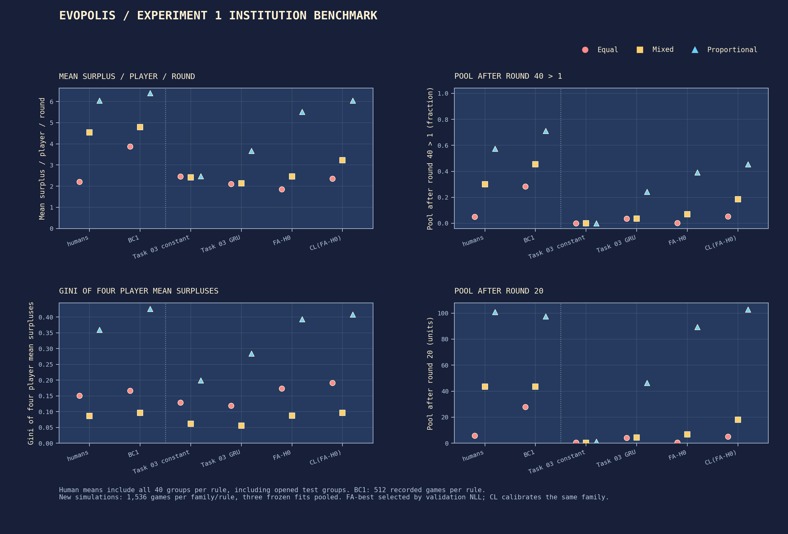
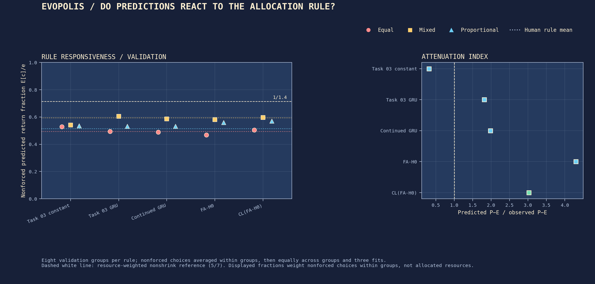
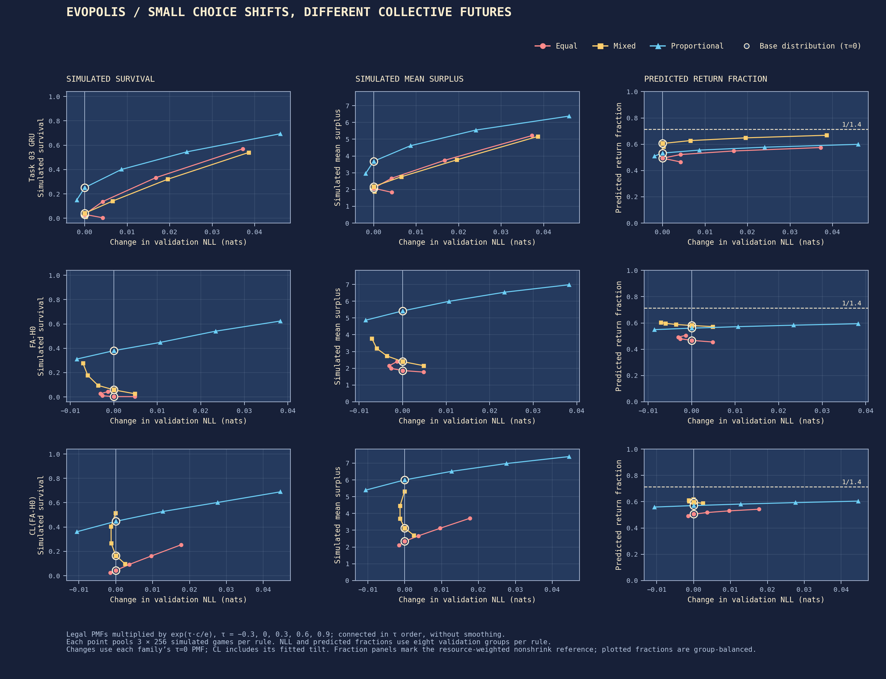
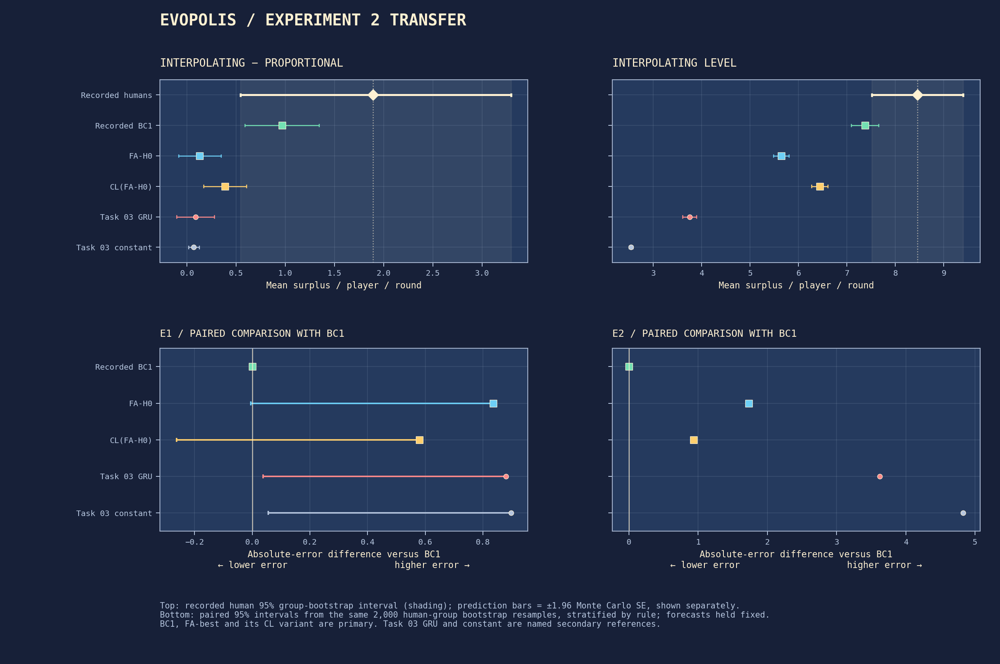

  

# EvoPolis: can learned human models predict which institution works?

## Abstract

We test whether behavioral models fitted to human common-pool decisions predict collective outcomes and differences between allocation rules, including an unseen rule. We compare recorded DeepMind BC1 simulations with neural and conditional models, a public institutional-response feature, and calibration to human outcome distributions. Nine new fits and 19 forecast families support a publicly frozen Experiment 2 transfer evaluation. The development criterion is met by FA-P0, FA-H0. Transfer comparisons with BC1 are FA-H0: rule-difference error not distinguishable, Interpolating-level error worse; CL(FA-H0): rule-difference error not distinguishable, Interpolating-level error worse. **No evolutionary search has run**; Experiment 3 remains closed.

## Introduction

> Does a behavioral model fitted to human play predict which allocation rule works, including a rule it never saw?

Institutions alter incentives and the trajectories of shared resources. A useful learned social world model must predict these changes, not merely assign reasonable probabilities to individual decisions. EvoPolis begins with the published four-person common-pool experiment of Koster, Pîslar and colleagues. Reproducing recorded outcomes, fitting new behavioral models and extending their evaluation are separate activities: these are new EvoPolis fits, while BC1/BC2 numbers are recorded upstream simulations.

Each round an allocation rule distributes resources, residents return contributions and keep the remainder. The scientific target is agreement with human behavior under each rule and with human differences between rules. Prosperous simulated inhabitants alone do not validate a model.

## Data and methods

The official release supplies human group trajectories and recorded behavioral-clone games. Experiment 1 provides 160 groups across Equal, Mixed, Proportional and M1, split into 96 training, 32 validation and 32 previously opened diagnostic test groups. Parameters and checkpoints use training/validation evidence only. Experiment 2 supplies 120 new groups across Proportional, Interpolating and M1. Forecasts, checkpoints, calibrated tilts, seed tables and analysis hashes were [committed and pushed](https://github.com/ReloadLightly/evopolis/commit/bf994ea7acc41592710f519802a75f2abe7e6b33) before opening its behavioral rows.

The published environment starts with 200 units, has four residents, and runs for 40 rounds. Allocations may be fractional; new models choose legal integers. With allocation e and contributions c, the next pool is min(200,R−Σe+1.4Σc). Under full allocation below capacity, nonshrinkage requires the allocation-weighted return fraction Σc/Σe≥5/7. This feedback threshold is not instantaneous depletion, and it differs from an unweighted mean of individual return fractions.

References include Task 03 constant/linear/feedforward/GRU, continued Task 04 feedforward/GRU, and Task 05 P0/P1/H0/H1. Three fresh FA families add a public slope relating current offer shares to previous contribution shares, with an undefined indicator. FA-best minimizes mean validation NLL across three starts. CL calibrates six lines with a legal exponential tilt, matching training-group outcome distributions instead of targeting higher surplus. Persistent resident effects are drawn once per game. History and posterior updates occur under frozen parameters; they are distinct from parameter training.

Every learned checkpoint simulates 512 games per rule, pooling 1,536 games over seeds 17/29/43. Recorded BC1 supplies 512 games per rule. Outcomes include 40-round surplus, Gini across four player means, survival (pool40>1), pool20 and depletion time. Energy U statistics compare (surplus/10,pool20/200,pool40/200). Intervals resample human groups 2,000 times; Monte Carlo uncertainty is reported separately. M1/M2 have no executable policy and support only recorded outcomes or teacher-forced offers. [Full protocol](docs/protocol.md) and [data inventory](docs/data-inventory.md).

## Results

### Experiment 1 and the incumbent benchmark

| Mean surplus/player/round | Equal | Mixed | Proportional |
| :--- | :--- | :--- | :--- |
| Humans (40 groups/rule) | 2.202 | 4.533 | 6.047 |
| BC1 (512 recorded games/rule) | 3.879 | 4.787 | 6.406 |
| Task 03 constant (1,536 games/rule) | 2.457 | 2.415 | 2.472 |
| Task 03 GRU (1,536 games/rule) | 2.102 | 2.131 | 3.663 |
| FA-H0 (1,536 games/rule) | 1.857 | 2.461 | 5.511 |
| CL(FA-H0) (1,536 games/rule) | 2.355 | 3.227 | 6.051 |

Human rows include all 40 groups per rule, including opened test groups. The [full benchmark](results/task06/benchmark.json) also evaluates training+validation groups alone and records survival, inequality, energy distances and institutional ordering.

### Tipping-point diagnosis and simple ingredients

The human validation Proportional−Equal choice-mean contrast is only 0.0216; FA-H0's index is 4.300. Ratios above one indicate amplification of this small contrast. The sensitivity curves compare changes in validation likelihood with changes in simulated survival and surplus; the fraction panels mark 5/7 with its resource-weighting caveat.

| Mixed; additional τ=0→0.6 | Validation ΔNLL | Survival | Surplus |
| :--- | :--- | :--- | :--- |
| Task 03 GRU | 0.0195 | 0.040 → 0.320 | 2.177 → 3.768 |
| FA-H0 | -0.0060 | 0.059 → 0.177 | 2.399 → 3.184 |
| CL(FA-H0) | -0.0013 | 0.165 → 0.405 | 3.130 → 4.448 |

All nine FA fits complete 480 epochs. **FA-best is FA-H0**; mean validation NLLs are FA-GRU 2.5915, FA-P0 2.5806, FA-H0 2.5637. Budget-boundary minima: FA-P0_43, FA-H0_43. The selected CL(FA-H0) validation-NLL cost is 0.0005 nats. All selected tilts and numerical checks are reported in the [study](docs/institutional-validity.md).

**D1: no headroom.** The decision compares surplus IE against BC1 on identical human groups and requires both strict human surplus and survival ordering. Qualifying candidates are FA-P0 (IE 0.743 versus matched BC1 0.876); FA-H0 (IE 0.871 versus matched BC1 0.876). Validation survival ties Mixed and Proportional at 0.375; validation surplus orders Equal < Proportional < Mixed. Consequently all CL candidates are mechanically ineligible under the strict-order criterion, regardless of their IE. This is a constraint of the declared decision rule, not evidence of inaccurate calibrated behavior.

### Frozen Experiment 2 transfer

Human surplus is 6.563 under Proportional and 8.456 under Interpolating. Their difference is 1.894, with 95% human-group interval [0.545, 3.295]. E1 tests this within-cohort difference; E2 tests the Interpolating level.

| Simulator | Predicted I−P | E1 \|error\| | E1 Δ\|error\| vs BC1: 95% CI; D2 | E2 \|error\| | E2 Δ\|error\| vs BC1: 95% CI; D2 |
| :--- | :--- | :--- | :--- | :--- | :--- |
| BC1 | 0.966 | 0.928 | [0.000, 0.000]; not distinguishable | 1.085 | [0.000, 0.000]; not distinguishable |
| FA-H0 | 0.130 | 1.764 | [-0.005, 0.836]; not distinguishable | 2.815 | [1.730, 1.730]; worse |
| CL(FA-H0) | 0.386 | 1.507 | [-0.262, 0.579]; not distinguishable | 2.019 | [0.934, 0.934]; worse |
| Task 03 GRU | 0.086 | 1.807 | [0.038, 0.879]; worse | 4.706 | [3.622, 3.622]; worse |
| Task 03 constant | 0.069 | 1.825 | [0.056, 0.897]; worse | 5.916 | [4.831, 4.831]; worse |

The first three rows are primary; the last two are named secondary references. Paired intervals compare absolute errors with BC1 using the same human resamples. **D2:** FA-H0: E1 not distinguishable, E2 worse; CL(FA-H0): E1 not distinguishable, E2 worse. Zero-width E2 percentile intervals reflect cancellation of the shared human mean when both fixed forecasts underpredict it; simulation Monte Carlo uncertainty remains separate. Separate effect/level Monte Carlo SEs are BC1 0.192/0.144; FA-H0 0.111/0.083; CL(FA-H0) 0.112/0.086.

All 57 learned checkpoints/variants were also scored on all 120 groups, with M1 likelihood separate. NLL averages nonforced choices within groups, then groups and fitted seeds equally. Survival contrasts, Proportional level errors, pool20 errors, energy distances, per-seed results and descriptive cohort shifts are in the [transfer artifacts](results/task06/transfer.json) and [full report](docs/institutional-validity.md).

### Roadmap and observatory

The development criterion was met, but transfer failed. Investigate instruction and cohort shift and resolve the allocation-replay convention before future replication; no evolutionary search is recommended.

The original 16-bit observatory displays recorded and learned trajectories. The cover is concept art; this image is an existing application screenshot. Task 06 changes no interface. Earlier evidence is documented in [behavioral agents](docs/behavioral-agents.md), [collective forecast fidelity](docs/collective-forecast-fidelity.md) and [conditional responses](docs/conditional-responses.md).

## Limitations

Experiment 2 changes participants and provides rule instructions absent in Experiment 1; the models have no instruction input. The within-cohort effect removes shared shifts only to first order. Published continuous Interpolating allocation has maximum offer replay residuals 7.2899 for BC1 and 7.39318 for human Experiment 2. The human Proportional residual is 0.00105384. Human transfer also contains an allocation-convention discrepancy. Scores evaluate the prespecified continuous implementation, without claiming exact institutional reproduction. BC1/BC2 terminal pools are equation-inferred because final next-pool fields are missing. BC1 used a different 537-game training collection, continuous actions and outcome-selected checkpoints; its Interpolating rule was also optimized against that simulator. The paper's component training counts conflict with its stated total; both are retained in the source audit. Participant identities cannot establish independence across launch groups. Exp 1 test outcomes were already opened, so later diagnostics are not pristine confirmation. Intervals spanning zero mean not distinguishable, not equivalence. These limits constrain causal and general claims beyond this game.

## References

Koster, R., Pîslar, M., et al. (2025). [Deep reinforcement learning can promote sustainable human behaviour in a common-pool resource problem](https://www.nature.com/articles/s41467-025-58043-7). Nature Communications 16, 2824. BC1 used Train Set 1; BC2 includes earlier experimental evidence and is descriptive here.

[Official DeepMind release, pinned revision 4f1a99a](https://github.com/google-deepmind/sustainable_behavior/tree/4f1a99a9d150f9fa6bad1a0f70f11c0673d46763). Adapted source retains attribution; see [source notes](docs/SOURCES.md), the [Task 06 specification](docs/tasks/06-institutional-validity.md) and [preregistered manifest](results/task06/manifest.json).
