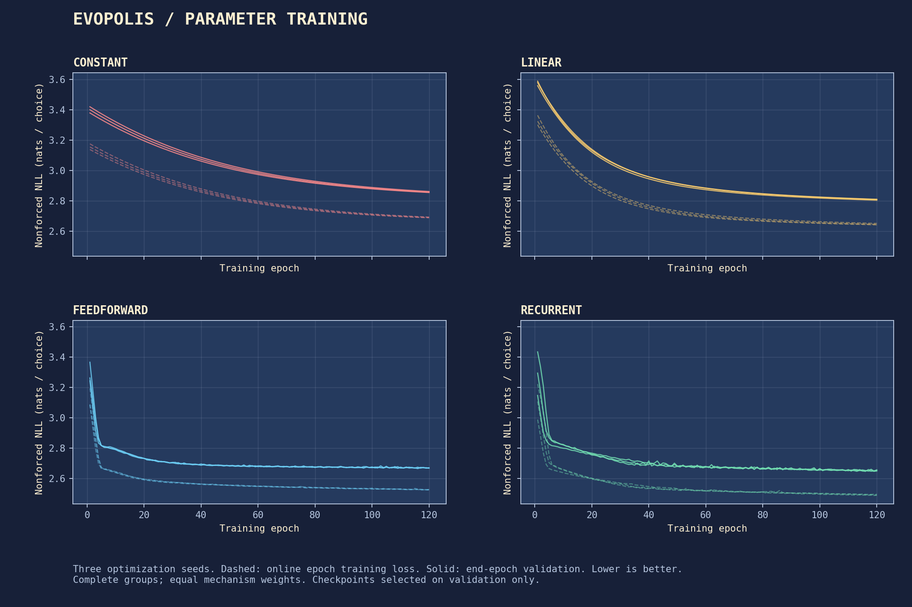
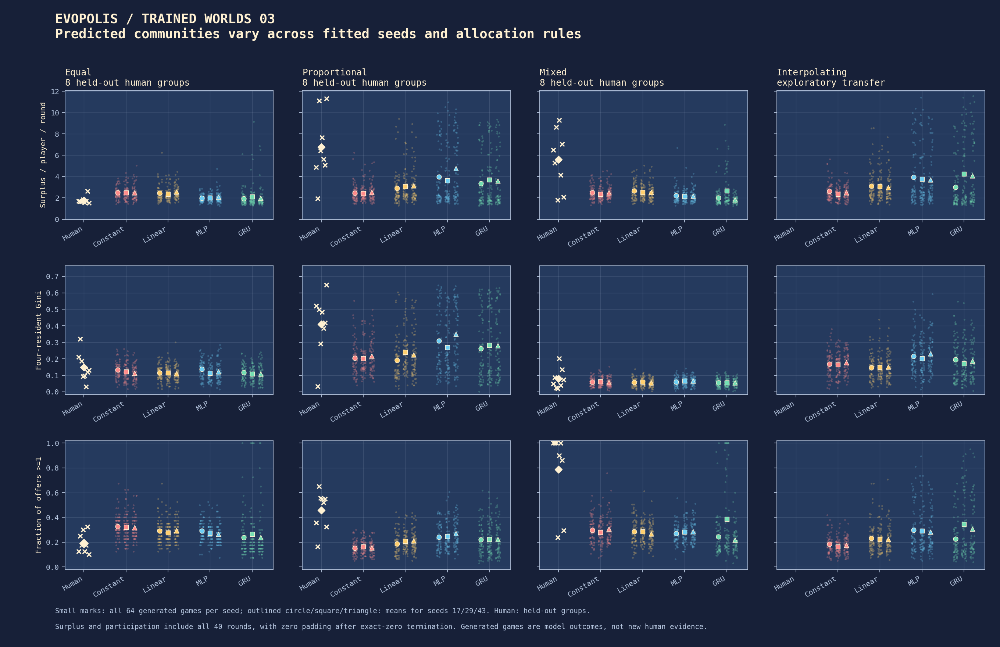
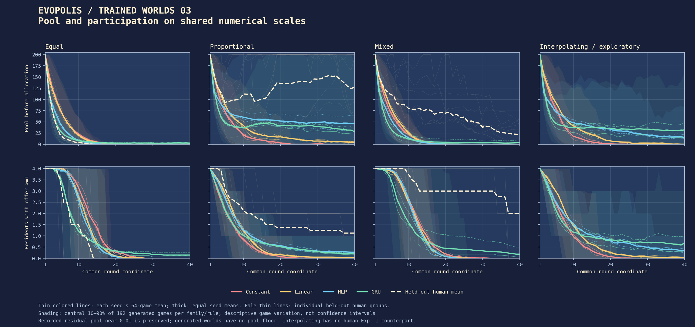

# The first trained inhabitants

Task 03 fits new probabilistic response models to human Experiment 1. These are EvoPolis models, not a reproduction of the unreleased upstream BC1 training pipeline. Predicting recorded choices and generating sustained communities are separate questions. Checkpoints are selected only by validation prediction; simulated prosperity never enters selection.

## Evidence and fixed experiment

The pinned source contains 160 Experiment 1 groups, 6,400 group-rounds and 25,600 player decisions. The preparation audit reproduces all **12,814 nonforced choices** and **12,786 forced zeros**, with no noninteger targets or legal-support violations. All 40 rounds remain in the histories. A choice is nonforced exactly when `floor(observed offer) >= 1`; offers are neither rounded upward nor adjusted with an epsilon.

The [split manifest](../results/task03/split.json) records all memberships. A single NumPy `Generator(PCG64(20261001))` permutes sorted full episode keys within sorted mechanism conditions, assigning 24/8/8 groups per mechanism to training/validation/test. The 96/32/32 groups retain all four resident sequences. No `launch_id` crosses a split. Participant identifiers are absent, so different group IDs cannot establish participant independence. Experiments 2–3 were excluded before parsing their numeric outcomes; Experiment 4 is deferred.

Scored choices and forced-zero fractions (training has 3,840 choices per mechanism; validation and test each have 1,280):

| Mechanism | Training nonforced / forced % | Validation nonforced / forced % | Test nonforced / forced % |
| :--- | ---: | ---: | ---: |
| Equal | 1,120 / 70.83% | 460 / 64.06% | 252 / 80.31% |
| Mixed | 2,025 / 47.27% | 859 / 32.89% | 1,007 / 21.33% |
| Proportional | 1,926 / 49.84% | 380 / 70.31% | 587 / 54.14% |
| Recorded M1 | 2,731 / 28.88% | 874 / 31.72% | 593 / 53.67% |

The primary denominators are **7,802 training**, **2,573 validation** and **2,439 test** choices, aggregated by group rather than pooled as independent observations.

Each model receives current offers, previous contributions and current pool: nine values divided by 200, with the focal resident first and the existing cyclic rotation. First-round previous contributions are zero. Current contributions, rewards, future pools, cumulative outcomes, mechanism labels, identities and remaining horizon are excluded. The GRU maintains separate resident states, reset between groups. Forced rounds still update memory. The feedforward model already receives one round of contribution history; the GRU comparison measures the value of additional learned recurrent history.

All four families use a zero/maximum-inflated beta-binomial emission. Its support is every integer from zero through the floor of the observed offer; endpoint masses include the beta-binomial's own endpoints. Shapes are `softplus(raw) + 0.05`. At a zero legal maximum the distribution is exactly `P(0)=1`, with zero primary loss. Double-precision log-gamma and log-sum-exp operations stabilize likelihoods. An unfitted uniform distribution over legal integers is a separate reference.

| Family | Architecture | Fitted parameters |
| :--- | :--- | ---: |
| Constant | Five input-independent emission parameters | 5 |
| Linear | Nine inputs to five outputs, with bias | 50 |
| Feedforward | 9 → 64 → 52 → 5; ReLU hidden layers | 4,285 |
| Recurrent | One-layer GRU with 32 hidden units; five-output head | 4,293 |

The [configuration](../configs/task03.json) fixes three training seeds (17, 29, 43), 120 epochs each, Adam at `1e-3`, weight decay `1e-4`, and gradient-norm clipping at 1.0. A shuffled batch comprises eight whole groups; two-group microbatches contribute their summed group losses divided by eight before one update. One CPU thread and no data workers keep memory bounded. There is no early stopping, schedule, architecture search or favorable-seed selection. The lowest validation score selects each fit's checkpoint, with exact ties going to the earliest epoch.

Primary NLL averages nonforced choices within each group, groups within each mechanism, then the four mechanisms equally. MAE and relative MAE use the same aggregation; relative MAE divides by the observed offer. Forced choices never enter headline calibration. The probability bins are fixed at increments of 0.1 and the offer-bin edges at `[1, 5, 10, 25, 50, 100, 201]` before test opening.

The test is held out from Task 03 fitting and selection, but Task 01 had already described all Experiment 1 groups. The opening receipt records the frozen configuration, all checkpoint hashes and code identity after every fit and validation selection is complete. Uncertainty averages the three seed scores within each group, then uses 2,000 paired mechanism-stratified group bootstrap draws with seed 20261003. Optimization seeds are not additional human replications. Published test outcomes cannot become pristine confirmation for later evolutionary searches.

## Measured predictions and learning

All **12 fits completed 120 epochs**. On the 32 test groups, the seed-averaged primary results are:

| Predictor | Nonforced NLL, nats (95% group interval) | MAE, units | Relative MAE |
| :--- | ---: | ---: | ---: |
| Uniform, unfitted | 2.9590 [2.7970, 3.1236] | 10.0643 | 0.2638 |
| Constant | 2.9224 [2.7635, 3.0887] | 8.6971 | 0.2531 |
| Linear | 2.8617 [2.7235, 3.0058] | 6.4423 | 0.2343 |
| Feedforward | 2.7238 [2.5884, 2.8644] | 5.6418 | 0.2171 |
| Recurrent GRU | 2.6944 [2.5642, 2.8352] | 5.5287 | 0.2019 |

The primary **GRU minus feedforward difference is −0.0294 nats**, with paired 95% interval **[−0.0637, +0.0063]**. The average favors the GRU slightly, but does not establish an advantage from added recurrent memory. Both models already receive previous contributions. Descriptively, GRU gains are larger under Equal and Mixed, while its M1 NLL is slightly worse; these are not independently confirmed mechanism-specific findings.

Seed-averaged NLL within each human mechanism:

| Predictor | Equal | Mixed | Proportional | Recorded M1 |
| :--- | ---: | ---: | ---: | ---: |
| Uniform | 2.2782 | 2.7139 | 3.5505 | 3.2936 |
| Constant | 2.3730 | 2.6979 | 3.3892 | 3.2296 |
| Linear | 2.3386 | 2.6899 | 3.2689 | 3.1495 |
| Feedforward | 2.1895 | 2.5967 | 3.1076 | 3.0014 |
| GRU | 2.1250 | 2.5269 | 3.0985 | 3.0272 |

| Paired primary comparison | NLL difference | 95% paired group interval |
| :--- | ---: | ---: |
| GRU − feedforward | −0.0294 | [−0.0637, +0.0063] |
| GRU − linear | −0.1674 | [−0.2105, −0.1223] |
| GRU − constant | −0.2280 | [−0.2791, −0.1752] |
| GRU − uniform | −0.2646 | [−0.3545, −0.1816] |

Training changed the parameters in a useful direction: mean validation NLL fell **3.411 → 2.857** for Constant, **3.612 → 2.807** for Linear, **3.446 → 2.668** for Feedforward and **3.408 → 2.649** for GRU. The three feedforward selected epochs are 109/116/117, and GRU epochs are 116/117/113 for seeds 17/29/43. Constant and Linear select epoch 120 for every seed. The curves retain all 120 epochs; selecting an earlier checkpoint did not stop training.




The models learn conditional response distributions more predictive than a fixed population distribution or uniform legal choice. This is evidence about human prediction, not simulated prosperity. Calibration remains imperfect: GRU assigns **19.43%** probability to maximum-feasible returns versus **16.18%** observed, with group/mechanism weights. Under Mixed allocation these are **24.62% versus 16.01%**. At offers from 5 to below 10, predicted maximum returns are **22.28% versus 11.46%** observed (11.04% of weighted choice mass). These failures remain reported; no architecture or hyperparameter was revised after test opening.

The [machine-readable summary](../results/task03/prediction_summary.json) includes every mechanism/seed score, seed ranges, relative errors, endpoint rates and paired intervals; [group metrics](../results/task03/prediction_groups.csv), [calibration bins](../results/task03/calibration.csv) and [initial-versus-fitted validation scores](../results/task03/learning.csv) support reanalysis. The [opening receipt](../results/task03/test_opening.json) is dated **2026-10-01 01:53:05 UTC**. Three seeds' aggregate GRU NLLs span 2.6913–2.6977, whereas variation across human groups is much larger. An [independent audit](../results/task03/independent_audit.json) reconstructed the means and paired bootstrap intervals from group CSVs without the scoring functions; maximum disagreement was **4.44e−16**.

## Reproduce and continue

Run from the Linux repository checkout with `uv` installed:

```bash
bash scripts/learn.sh prepare
bash scripts/learn.sh benchmark
bash scripts/learn.sh train
bash scripts/learn.sh evaluate
bash scripts/learn.sh generate
bash scripts/learn.sh verify
bash scripts/learn.sh plot
bash scripts/viewer.sh --port 8765
```

The locked dependency uses **PyTorch 2.10.0+cpu** from the [official CPU wheel index](https://download.pytorch.org/whl/cpu), following the [PyTorch installation instructions](https://pytorch.org/get-started/previous-versions/). There are no CUDA dependencies. Preparation streams only the needed columns from the pinned CSV into ignored compact arrays. The benchmark uses training groups only and discards its state before declared fits restart from their seeds.

Before importing PyTorch the machine had **918,676 KiB available RAM**, effectively full 1 GiB swap, eight logical CPUs, and 952.5 GB free disk. Two training-only epochs per family peaked at **323,808 KiB RSS** and estimated 323.6 seconds of training before validation/checkpoint overhead. The completed final 12-fit invocation took **439.53 seconds**, peaking at **306,864 KiB RSS**. Generation took **31.76 seconds**, peaking at **319,620 KiB RSS**. These are separate process peaks; no browser ran during these jobs. Resource measurements and the discarded repair run are preserved under `results/task03/`.

`train` also resumes an interrupted run. Each fit atomically saves a best-validation checkpoint and a last-epoch checkpoint in `results/task03/weights/`. The latter includes optimizer, epoch, RNG/shuffle state, best score and logs. Continuation validates the source, split, configuration and relevant code hashes. Completed fits are retained. Raw data and preparation caches stay outside Git; all trained weights and their metadata are published.

A pre-test correctness repair made continuation survive publication: the original Git base revision remains provenance, while exact source-file hashes establish compatibility. Before this fix, a later commit would reject an otherwise unchanged checkpoint. The initial 1,213 fitted epochs were discarded and archived locally, and all declared fits restarted from their seeds. This added 206.85 seconds of measured epoch work; all overlapping training and validation losses are bit-identical. No numerical rule, architecture or hyperparameter changed, and no test results had been opened. The [repair record](../results/task03/pretest_repair.json) preserves the affected fits and budget accounting.

A second pre-test repair explicitly detached constant-parameter views before NumPy export; no fitted model changed or required retraining. The 40-test suite passed, followed by three generator checks covering all four actual families after that export repair. Two independent CPU processes reproduced the exact raw validation-prediction hashes of every best checkpoint; the evaluation also reproduced each saved validation score. Tests cover emission normalization against SciPy, overlapping `n=0/1` support, finite gradients, observation timing/rotation, recurrent isolation, exact Adam/shuffle resume equivalence, independent sampling and full-horizon accounting.

## Generated communities and scope

The generation seed table is declared before test opening: four fitted families × three training seeds × four executable rules × 64 independent games = **3,072 games**. The seed namespace is 20261004, separate from fitting, splitting and bootstrap seeds. All best-validation checkpoints contribute every prescribed game. Resident weights are shared but histories and conditional action draws are separate. All four distributions precede the simultaneous world update. Parameters stay frozen throughout play; recurrent memory updates are not online weight learning.

Equal, Proportional, Mixed and Interpolating use the existing Python environment. The recorded RL M1 mechanism remains available for recorded playback and teacher-forced prediction only. Generated M1 communities are not claimed. Interpolating has no Experiment 1 human counterpart and is labeled exploratory transfer.

Every generated summary has a common 40-round denominator: total retained resources divided by 160. Exact-zero endings receive zero pool, offers, returns and surplus padding; cumulative surplus stays at its final value. Actual ending time remains separate. Depletion below one, exact-zero termination, offers at least one and final sustainment above one are distinct diagnostics. The reconstructed environment does not introduce the source's undocumented 0.01 pool floor.

All **3,072 games** are saved in the **28,114,944-byte** archive, comprising 45,081 executed and 77,799 padded group-rounds. No generated Gini denominator is zero in this run. [Per-game results](../results/task03/generated_groups.csv) and [48 cell summaries](../results/task03/generated_outcomes.json) include all training seeds, actual endings, depletion, active allocations and final sustainment.





Generated GRU communities do **not** reproduce several collective human outcomes. Mean surplus under Equal/Mixed/Proportional is **2.013/2.178/3.563**, versus **1.788/5.594/6.756** in the corresponding eight held-out human groups per mechanism. GRU final sustainment is **3.65%/4.69%/18.75%**, compared with **0%/50%/87.5%** in those human groups. These small human samples and simulated distributions are descriptive comparisons, not new treatment-effect estimates. The observed 0.01 pool tails and generated exact-zero padding also differ mechanically. Interpolating yields GRU mean surplus 3.780, but has no Task 03 human comparison and establishes no institutional improvement.

The viewer's **New trained EvoPolis agents** source exposes all generated games, with family, training seed, selected epoch, checkpoint hash and exact rollout seed. The display default is the median-surplus Equal game from the predeclared GRU seed 17, with stable rollout-index tie-breaking. This is a display rule, not selection of the best training seed. Comparison panes share round coordinates and corresponding y-axis limits. Padding is labeled explicitly.

The default is `trained-recurrent-17-equal-039`, selected epoch **116**, rollout seed **4128699797167127739**. In its first round the model's expected return is **22.1883** from an allocation of 50 for each resident; independent sampled returns are **26, 38, 26, 14**. This community reaches exact zero after round 9; later displayed rounds are padding. A fresh CPU process reproduced all 64 games in this checkpoint/rule cell exactly, including saved predictions. All 3,072 accounting paths and full-horizon summaries passed independent replay through the numerical environment.

These models can miss interior multimodality and heaping; independent conditional action sampling also omits residual coordination between people. Predictive improvement does not establish faithful multi-round counterfactuals. The completed [Task 04 forecast study](collective-forecast-fidelity.md) preserves every result above and continues the six neural fits to 480 epochs: individual prediction improves, but the declared primary GRU collective forecast worsens. Genuine institution-shift transfer and any institutional search remain later work.
