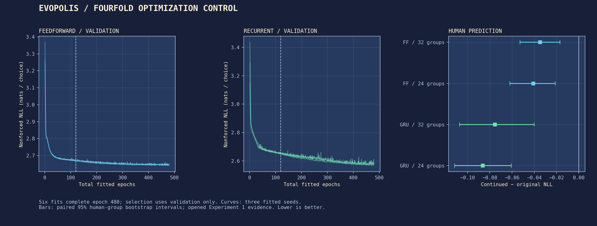
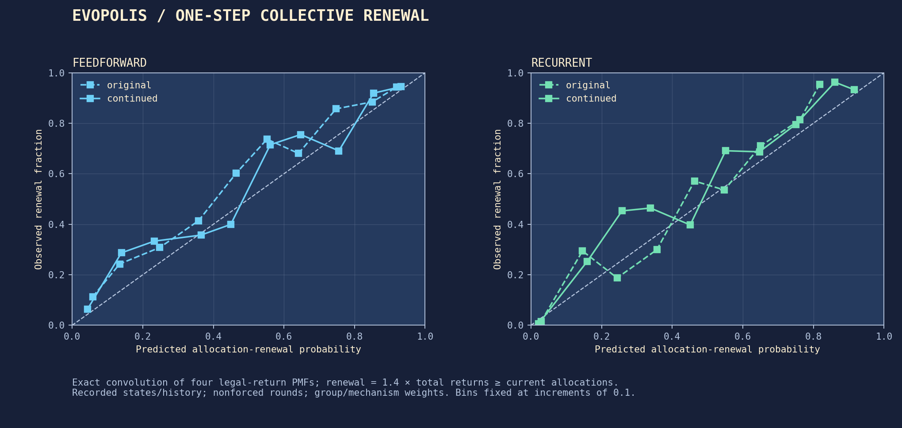
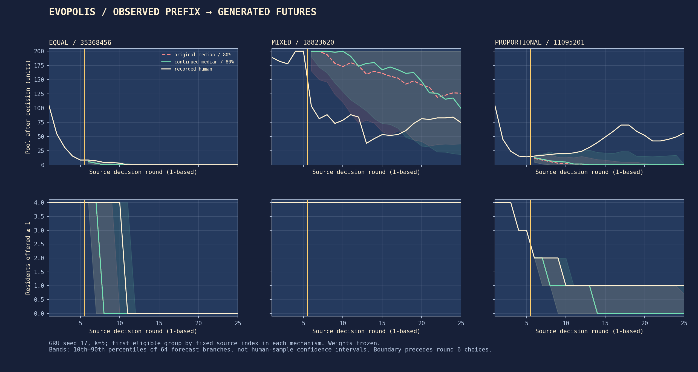
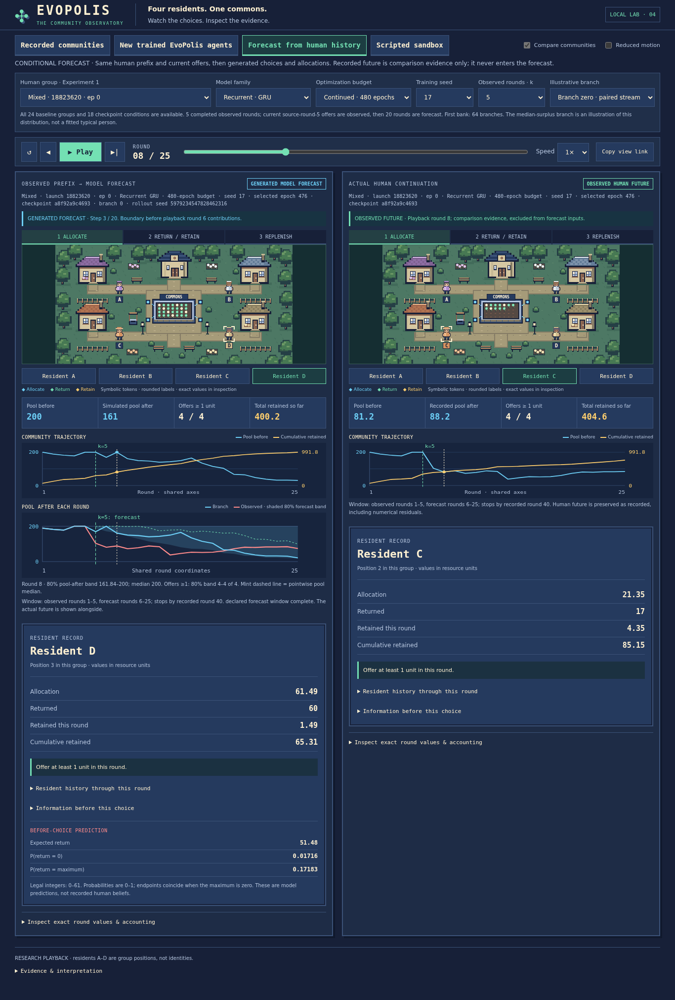

# Collective forecast fidelity

Task 04 tests whether the Task 03 models were simply under-optimized, then measures how far they forecast collective outcomes from observed human history. This is a declared diagnostic follow-up informed by already published Experiment 1 results. The groups remain held out from parameter fitting and validation selection, but their outcomes are not fresh confirmation of a new modeling hypothesis. Experiments 2–3 remain reserved for a separately declared transfer study; Experiment 4 is deferred.

**Measured conclusion:** additional optimization improves individual prediction in both neural families, but **worsens the declared primary GRU collective forecast**. The independent Monte Carlo bank agrees. Feedforward's small primary collective improvement remains uncertain. The next scientific question is why better individual likelihood does not preserve collective renewal, and how this defect compounds through resource feedback.

## The fixed optimization control

The six neural fits—Feedforward and GRU, seeds 17, 29 and 43—restore their original **epoch-120 last checkpoints**, including Adam moments, optimizer steps, Torch RNG and PCG64 shuffle state. Each adds 360 epochs, reaching epoch 480. The 96 training and 32 validation groups, observations, emission distribution, architecture, loss, optimizer and learning rate remain unchanged. Training uses one CPU thread, no data workers and two-group microbatches accumulated into an eight-group update. All four complete resident sequences stay together.

Selection considers every epoch from 1 through 480, including the original best-validation checkpoint, and breaks exact ties by earliest epoch. Every fit completes epoch 480; validation selection is not early stopping or selection for simulated cooperation. The twelve original fitted checkpoints are frozen references; six continued checkpoints give eighteen forecast conditions. The [configuration](../configs/task04.json), [continuation identity](../results/task04/frozen_training.json) and [original-file manifest](../results/task04/preservation.json) document this boundary. Original Task 03 weights, split, figures, numerical results and hashed scientific source files are preserved byte for byte.

All six fits completed the budget. Selected epochs for seeds 17/29/43 are **478/444/473** for Feedforward and **476/460/470** for GRU. Mean selected validation NLL falls **2.6680 → 2.6419** for Feedforward and **2.6490 → 2.5702** for GRU. Several selections remain near the new limit; epoch 480 is not evidence of convergence.

### Individual prediction improved

| Model | Original NLL, 32 groups | Continued NLL, 32 groups | Paired change (95% group interval) | Original → continued NLL, matched 24 groups |
| :--- | ---: | ---: | :--- | :--- |
| Constant reference | 2.9224 | — | Frozen | 2.8200 → unchanged |
| Linear reference | 2.8617 | — | Frozen | 2.7658 → unchanged |
| Feedforward | 2.7238 | 2.6890 | −0.0347 [−0.0528, −0.0170] | 2.6313 → 2.5903 |
| GRU | 2.6944 | 2.6189 | −0.0755 [−0.1071, −0.0400] | 2.5835 → 2.4970 |

NLL is nats per nonforced individual choice, with the unchanged within-group and equal-mechanism weighting. On the matched baseline cohort, the Feedforward change is **−0.0409 [−0.0620, −0.0212]** and the GRU change **−0.0864 [−0.1116, −0.0607]**. The gain therefore does not depend on including recorded M1. Every original per-group score agrees with Task 03 within the saved numerical check. [Individual group scores](../results/task04/individual_groups.csv) and the [one-step summary](../results/task04/one_step_summary.json) retain all seeds, conditions and paired intervals.



### One-step collective renewal remains imperfect

| Procedure | Total-return NLL ↓ | Renewal Brier ↓ | Predicted renewal | Observed renewal |
| :--- | ---: | ---: | ---: | ---: |
| Constant, original | 3.7347 | 0.20244 | 24.94% | 36.98% |
| Linear, original | 3.6564 | 0.16658 | 27.71% | 36.98% |
| Feedforward, original | 3.5801 | 0.15918 | 29.07% | 36.98% |
| Feedforward, continued | 3.5459 | 0.15843 | 29.72% | 36.98% |
| GRU, original | 3.3644 | 0.12930 | 34.42% | 36.98% |
| GRU, continued | 3.3084 | 0.13801 | 31.35% | 36.98% |

Total-return NLL is nats per scored group-round, distinct from individual-choice NLL. The GRU's aggregate-return likelihood improves by **−0.05595 [−0.08855, −0.02404]**, while its renewal Brier point estimate worsens by **+0.00871 [−0.00018, +0.01744]**. The Brier interval includes zero. Under Mixed allocation, predicted renewal falls by **8.45 percentage points** and Brier rises by **0.02241**; these condition-specific diagnostics are exploratory. Improved likelihood of exact totals does not require improved calibration of a particular collective event. These errors already appear under recorded states and history, before simulated history can drift.



## Forecast information and physical accounting

Forecasts use the same 24 Experiment 1 test groups under Equal, Mixed and Proportional allocation, eight per rule. The recorded M1 allocation mechanism is unavailable, so its records remain in the unchanged individual-prediction comparison only. Interpolating has no Experiment 1 human counterpart and is outside this study.

The origin `k` is the number of completed observed rounds: 0, 5, 10 or 20. The boundary falls **after the observed allocation for source round k, before its contributions**. A GRU processes only observations for rounds `0..k-1` to warm four separate resident states; its next call processes the origin observation once. Every family receives the same current offers, previous contributions and pool, with the existing cyclic resident ordering and normalization by 200. Current or future choices never enter forecast inputs.

All four residents sample independently conditional on their available information, then their choices resolve simultaneously. The first round preserves the recorded allocation and any unallocated resource. Thereafter the existing allocator receives generated previous contributions and generated pool. No later observation is forced back onto the simulation. Exact zero is absorbing; future pool, offers, contributions and round surplus are zero-padded, while cumulative forecast-window surplus stays constant. A branch cannot extend beyond source round 39.

Recorded futures retain their original pool values and rewards. They are not replaced with equation-based estimates. The sensitivity changes only the first allocation to the canonical allocator, with identical warmed history and paired random streams; it does not add an unexplained 0.01 pool floor or an epsilon to integer support. Legal actions remain `0..floor(offer)`.

The [numerical audit](../results/task04/numerical_audit.json) confirms all **96 origins are feasible**, leaving **0.0008049011–0.0012054443** units unallocated. Across 960 recorded rounds, **166 of 3,840** legal maxima differ from canonical allocations: Equal 32, Mixed 32 and Proportional 102, all one unit higher canonically. However, **none of the 84 player maxima at the 21 eligible k=5 origins changes**. The declared sensitivity is still run in full; at this primary boundary it checks small allocation/input differences rather than a support change. Recorded transition residuals range from **−0.0012024 to +0.0091951** units, with mean absolute residual **0.0032683**. These are reported numerical conventions, not evidence that arithmetic explains the collective discrepancy.

## Scores, uncertainty and finite simulation

The primary endpoint is the joint vector `(pool_after_h / 200, retained_resources_within_window / (200*h))` at `k=5, h=10`. Retained resources include all four residents but exclude the observed prefix. The primary population is eligible using only the origin: at least one recorded current offer must be at least one. This gives 21 groups: five Equal, eight Mixed and eight Proportional.

For each checkpoint and human group, the energy score uses 64 two-dimensional draws and the off-diagonal pair denominator `2*M*(M-1)`. Finite-sample estimates are not clipped. Each fitted seed is scored separately; its score is then averaged with the other two within the human group. Groups are averaged within rule, and the three rule means equally. The primary effect is continued minus original GRU score; feedforward is secondary. Lower is better.

The 2,000 paired, mechanism-stratified group bootstrap replicates use PCG64 seed 20261014. The same resampled groups apply to every procedure. These intervals describe human-group sampling uncertainty conditional on the fitted seeds and finite forecast banks. Training seeds, residents, rounds and Monte Carlo branches do not enlarge the human sample. Cross-group repeat participation cannot be checked from released identifiers.

The fixed budget comprises:

- **110,592 principal branches:** 18 checkpoints × 24 groups × 4 origins × 64 branches, up to 20 rounds. Each branch supplies horizons 1, 5, 10 and 20.
- **24,192 independent second-bank branches:** 18 checkpoints × 21 primary-eligible groups × 64 branches, ten rounds. This is a Monte Carlo stability check, never pooled into a replacement primary score.
- **16,128 sensitivity branches:** 12 original/continued neural checkpoints × 21 primary-eligible groups × 64 branches, ten rounds, canonical first allocation with main-bank streams.

There are **150,912 branches** in total. [The seed table](../results/task04/forecast_seeds.json) uses namespace 20261015 and full source-group identity, origin, family, training seed, bank and branch index. Original and continued budgets share streams within family; each resident has a distinct stream. This coupling reduces Monte Carlo comparison noise and does not establish individual human counterfactuals.

All-group and origin-eligible secondary results are reported separately. At `k=20`, no Equal group is eligible; its score is unavailable, and any available-rule average is explicitly different from the three-rule estimand. Marginal pool/surplus CRPS uses the same off-diagonal estimator, and 80% intervals use the empirical 10th and 90th percentiles with linear interpolation. Mean per-round marginal pool CRPS is a separately labeled trajectory score. Joint endpoint energy does not validate the full temporally dependent path.

One-step collective calibration conditions on recorded observations and histories. The exact convolution of four legal integer-return PMFs gives the total-return distribution. Headline aggregate NLL and renewal Brier scores exclude rounds where all actions are forced. Renewal means `1.4 * total_return >= sum(current_offers)`. Probability bins were fixed at increments of 0.1. Round scores are averaged within group, then groups and mechanisms are weighted equally. This calculation assumes conditional independence; error cannot uniquely identify marginal misspecification, heterogeneity or social dependence.

## Measured collective forecasts

The primary population and endpoint were fixed before the new comparisons. All eighteen checkpoint conditions complete the declared forecast design; no branch or failed community is filtered for success.

| Procedure | Joint endpoint energy ↓ | Pool CRPS ↓ | Surplus CRPS ↓ | Mean per-round pool CRPS ↓ | Pool 80% coverage | Surplus 80% coverage |
| :--- | ---: | ---: | ---: | ---: | ---: | ---: |
| Constant, original | 0.25909 | 0.26103 | 0.01697 | 0.17878 | 13.61% | 57.22% |
| Linear, original | 0.20859 | 0.20939 | 0.01447 | 0.13577 | 23.33% | 58.61% |
| Feedforward, original | 0.16271 | 0.16134 | 0.01523 | 0.11329 | 37.22% | 60.28% |
| Feedforward, continued | 0.15708 | 0.15567 | 0.01447 | 0.11082 | 43.61% | 63.06% |
| GRU, original | 0.09660 | 0.09518 | 0.00846 | 0.07050 | 48.33% | 80.83% |
| GRU, continued | 0.12538 | 0.12422 | 0.00911 | 0.08538 | 40.00% | 90.28% |

These are first-bank, `k=5, h=10`, origin-eligible, equally weighted mechanism means. Pool and surplus scores use the fixed normalized coordinates; the trajectory column is the mean of per-round marginal pool CRPS, not a joint temporal score. Coverage is likewise group/mechanism weighted. Nominal 80% coverage is not a sharpness measure. A source pool near 0.01 can lie outside a forecast interval collapsed at zero despite tiny absolute error, so coverage should be read with the proper scores and numerical audit.

| Paired budget effect | First-bank difference (95% group interval) | Independent second-bank difference (95% group interval) |
| :--- | :--- | :--- |
| **GRU, primary** | **+0.028779 [+0.007467, +0.053518]** | **+0.029439 [+0.006633, +0.055703]** |
| Feedforward, secondary | −0.005627 [−0.013847, +0.001719] | −0.008523 [−0.018857, −0.000110] |

Both banks show deterioration in the primary GRU endpoint. Their effect estimates differ by only 0.000660. Feedforward's mean improves in both, but the first-bank interval includes zero and the second barely excludes it. The declared primary bank remains authoritative; the second does not justify replacing an uncertain result with a favorable one. The banks are not pooled, and no additional Monte Carlo draws were requested after seeing these results.

GRU's mean per-round pool CRPS also worsens by **+0.014885 [+0.004892, +0.027209]**, so deterioration is not confined to the endpoint metric. By mechanism, the primary GRU energy change is **−0.004550 Equal, +0.059419 Mixed and +0.031469 Proportional**. These are descriptive subdivisions of the declared primary comparison.


### Horizon and observed prefix

At the primary `k=5` origins, the GRU energy changes at horizons 1/5/10/20 are **+0.001459 / +0.015344 / +0.028779 / +0.063974**. The one-round interval includes zero; the discrepancy grows over the generated future. This pattern supports investigating error amplification through resource feedback. It does not establish a uniquely recurrent failure or a full-path distribution result. At `k=0`, the GRU improves at horizons 5 and 10 and worsens at 20, so not every collective forecast deteriorates.

| Origin k | Eligible Equal / Mixed / Proportional | Continued GRU h=10 energy, all 24 groups | Continued GRU h=10 energy, eligible population |
| ---: | :--- | ---: | ---: |
| 0 | 8 / 8 / 8 | 0.23021 | 0.23021 |
| 5 | 5 / 8 / 8 | 0.12501 | 0.12538 |
| 10 | 2 / 7 / 7 | 0.13273 | 0.15181 |
| 20 | 0 / 6 / 7 | 0.07760 | 0.14491, **Mixed/Proportional only** |

The `k=20` eligible Equal stratum is unavailable; its score is not imputed. The two-rule mean is not the same three-rule estimand. Lower all-group error at later origins partly reflects already-depleted observed states and is not by itself evidence for the value of learned memory. Every origin/horizon, both populations, every fitted seed, marginal CRPS, coverage and trajectory score is retained in [8,802 score rows](../results/task04/forecast_scores.csv) and the [forecast summary](../results/task04/forecast_summary.json).



The illustrated cases are the first eligible group by fixed source index in each rule, with GRU seed 17 under both budgets; no accuracy criterion selects them. They show different errors: the Mixed example overpredicts the future pool, while the Proportional example misses a human recovery. The shaded ranges are 64-branch pointwise forecast distributions, distinct from fitted-seed variation and human-group confidence intervals.

### Numerical sensitivity

Canonical-minus-recorded first-allocation energy shifts at the primary origin/horizon are **+0.00028450 / +0.00004035** for original/continued Feedforward and **+0.00005882 / +0.00024698** for original/continued GRU. Thus the GRU budget effect changes by only **+0.00018816**, far below its primary deterioration of +0.02877940. Original and continued models share branch streams within each family; the canonical arm also reuses the main-bank streams.

This particular first-boundary convention does not explain the primary deterioration. It does **not** rule out all numerical differences: the primary origins have no changed integer maxima, whereas the full recorded episodes contain 166 differences, and the source's apparent 0.01 floor remains unreconstructed. Small perturbations may also affect later integer boundaries. All prescribed sensitivity branches were retained, including unfavorable ones.

### Which explanation to investigate next

The simplest insufficient-optimization explanation is inadequate for this primary endpoint: quadrupling the budget improves validation and individual test likelihood while worsening the collective forecast. Calling this generic individual-prediction overfitting would misdescribe the evidence. Nor can later simulated-history drift alone explain the recorded-state renewal errors.

The supported next investigation is **joint conditional response calibration and how its errors compound through feedback**. Targeted comparisons should distinguish a restrictive marginal emission, persistent resident/group differences and residual dependence between simultaneous decisions. Conditional independence is an explicit assumption of the current convolution and rollout, not an empirically established property. Task 04 does not identify which alternative will work or justify choosing a model for cooperation. New architectures and transfer to reserved Experiments 2–3 require a separately declared protocol, with their instruction differences addressed before outcome inspection.

## Verification and resource use

All **50 Python tests passed in 10.069 seconds**. Consequential checks cover exact optimizer/RNG continuation, overlapping endpoint support, causal observation timing, GRU state isolation, source-boundary residuals, simultaneous choices, horizon indexing, exact-zero padding, hand-calculated off-diagonal proper scores, unequal-stratum group weighting and read-only viewer values.

The independent [saved-evidence audit](../results/task04/independent_score_audit.json) uses SciPy condensed distances, a sorted scalar-CRPS identity and a separate group-difference bootstrap. It rechecks **1,008 primary checkpoint/group banks, representing 64,512 branches**, against untouched source endpoints. Maximum disagreement is **2.22×10⁻¹⁶** for energy/CRPS and **3.47×10⁻¹⁷** for interval endpoints. It also checks all six complete learning curves, earliest validation selections, parent/checkpoint hashes, and **102 byte-identical preserved files**.

A [fresh-process check](../results/task04/forecast_verification.json) exactly regenerates all 64 branches in the default cell, including saved predictions. Archive verification checks endpoint/path consistency and absorbing padding for every branch, plus **81,720 saved illustrated round records**. Generation itself checks all **2,615,040 prescribed rounds**: **1,391,232 executed and 1,223,808 padded**, with zero measured resource-transition residual, allocation excess or integer-support violation. The final archive is **38,920,192 bytes**, SHA-256 `1d1b461ea89852648e5c5de665b5b2827bceb40695f13f72e4b7b1db2173ea34`.

Before importing Torch, WSL had **857,172 KiB available RAM**, a full **1 GiB swap**, eight logical CPUs and **950.2 GB free disk**. The disposable training benchmark ran exactly two full epochs total, one per architecture, and no test or validation scores. The forecast-throughput benchmark used only a validation group and selected a 64-branch inference chunk (256 residents), peaking at 301,584 KiB. It did not select a model or alter the experiment.

| Main job | Wall seconds | CPU seconds | Peak process RSS, KiB |
| :--- | ---: | ---: | ---: |
| Six continuations, 2,160 additional epochs | 823.759 | 872.760 | 308,352 |
| Individual and one-step collective evaluation | 9.750 | 10.325 | 333,836 |
| All 150,912 forecast branches | 411.486 | 326.875 | 314,760 |
| Forecast scoring and summaries | 13.335 | 14.352 | 70,196 |
| Independent score/preservation audit | 2.730 | 2.832 | 96,184 |

These are separate process measurements, excluding preparation, tests, browser work and plotting; CPU and wall are measured separately, not inferred from each other. Numerical jobs run sequentially with the existing CPU-only lockfile and shared process lock. Browser verification follows numerical jobs.

Two operational issues are documented without changing the numerical experiment. Before main training, the [preflight repair](../results/task04/preflight_repair.json) deep-copied Adam state during restoration because PyTorch's loader could otherwise mutate the in-memory parent snapshot during a disposable check; original files were never modified. Both architectures' resumed updates are exactly equal to uninterrupted updates, with original Adam step 1,440. The two benchmark epochs were not repeated. A [wrapper note](../results/task04/wrapper_note.json) records a shell error after completed training caused by extending the wrapper while it was running. All six fits, their reload checks and the completion receipt had already finished; no epoch was omitted or retrained. The current wrapper passes syntax checks and subsequent commands completed normally.

## Reproduce and inspect

The committed weights, endpoint distributions, paths needed for scoring and selected complete branches support playback without retraining. Launch the existing town:

```bash
bash scripts/viewer.sh --port 8765
```

Open **http://127.0.0.1:8765/?mode=forecast**. The forecast view marks the observed/forecast boundary and compares the selected generated branch with the actual continuation on a shared clock and numerical scales. Its bands describe the 64-branch forecast distribution, not confidence about the human sample. The deterministic default uses the first sorted Mixed test group, continued GRU seed 17, origin 5 and branch 0. A median-surplus branch is an optional illustration, never a replacement for scoring the distribution. All groups, model conditions and failed forecasts remain accessible.



The [Chromium verification](../results/task04/browser-verification.json) passed all 21 recorded, sandbox, trained-agent and forecast interaction flows, plus URL restoration, keyboard selection and a 390-pixel mobile layout. Browser errors and console logs were empty. The real screenshot shows Mixed launch 18823620, episode 0, continued GRU seed 17 (selected epoch 476), origin 5 and branch 0 at playback round 8. Its first forecast returns, **30/0/44/47**, and rollout seed **5979234547828462316** match the fresh-process Python witness. The [viewer guide](viewer.md) describes the controls and provenance labels.

To reproduce the experiment from the preserved Task 03 results and verified compact human arrays:

```bash
bash scripts/forecast.sh benchmark-train
bash scripts/forecast.sh verify-continuation
bash scripts/forecast.sh train
bash scripts/forecast.sh prepare
bash scripts/forecast.sh benchmark
bash scripts/forecast.sh observations
bash scripts/forecast.sh generate
bash scripts/forecast.sh scores
bash scripts/forecast.sh verify
bash scripts/forecast.sh plot
```

`train` resumes atomic continuation checkpoints, and `generate` resumes complete committed forecast cells under a frozen identity. Run numerical commands sequentially and close browser processes during them. A compatible locked CPU-only PyTorch environment is required for fitting and regeneration, while the viewer reads saved artifacts without importing Torch. On a fresh checkout, prepare the unchanged human cache with `bash scripts/learn.sh prepare` first. Profile current RAM/swap and disk before launching Torch; the saved resource report describes this run, not a promise about another machine.

The [Task 03 review](task03-review.md) sets out the broader scientific question. Task 04 is a budget and forecast-fidelity control, not institutional optimization, evolutionary search, proof of convergence or online parameter learning.
