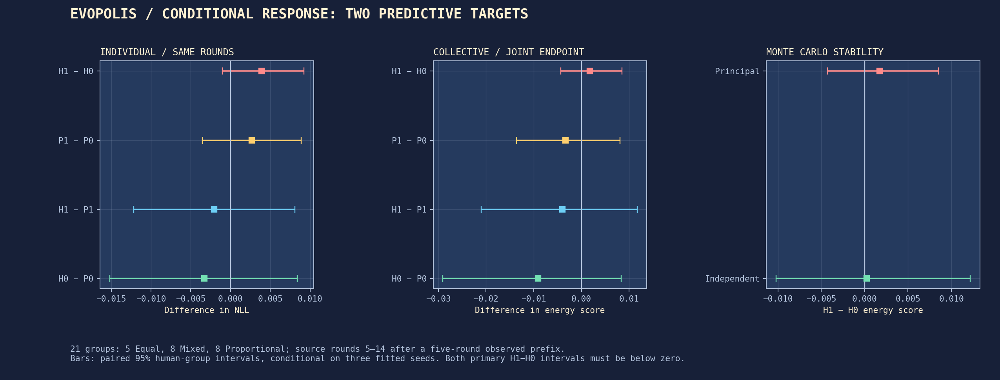
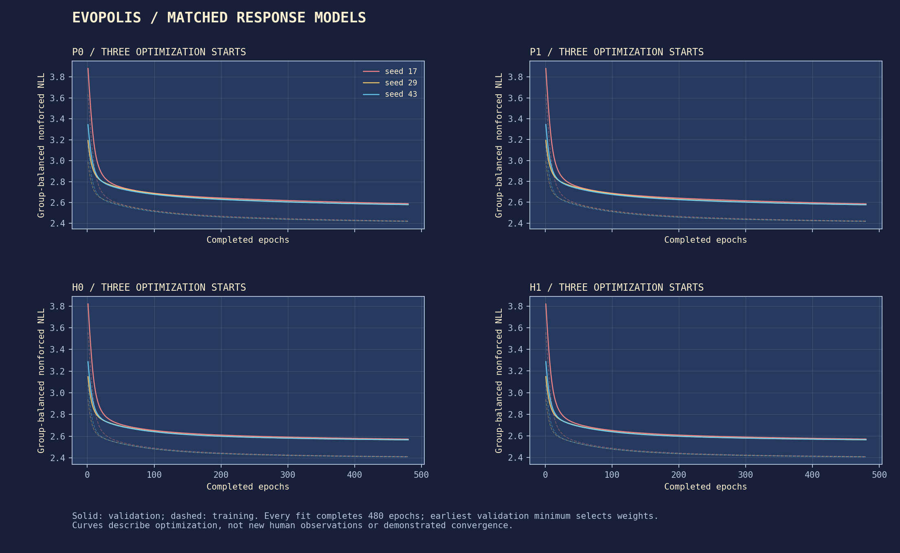
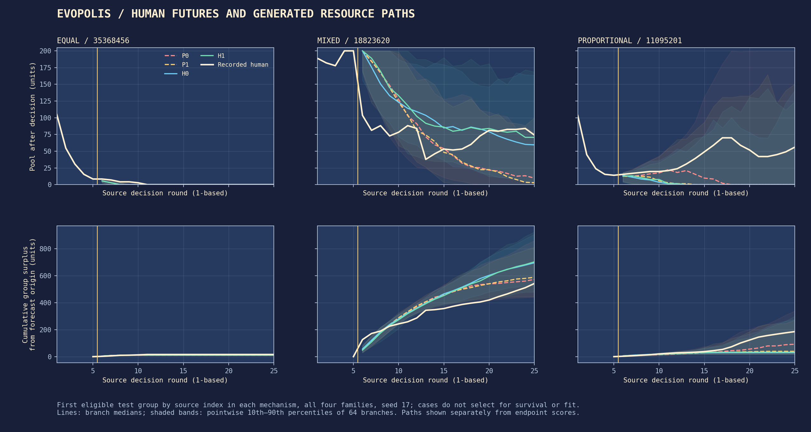
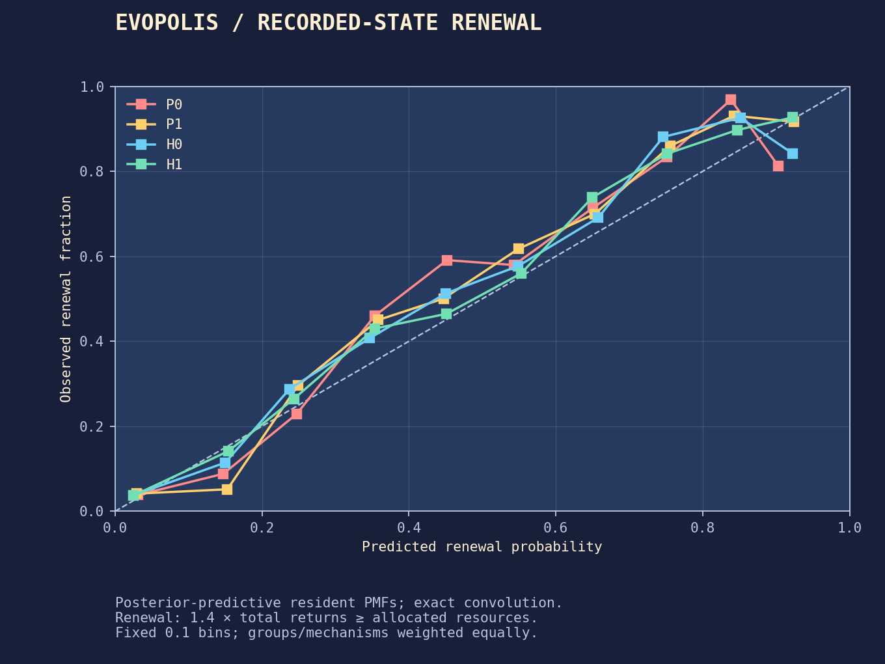
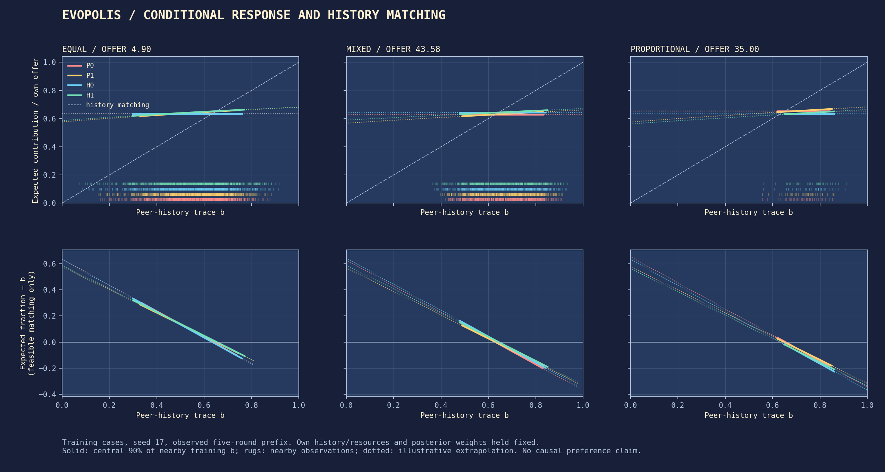
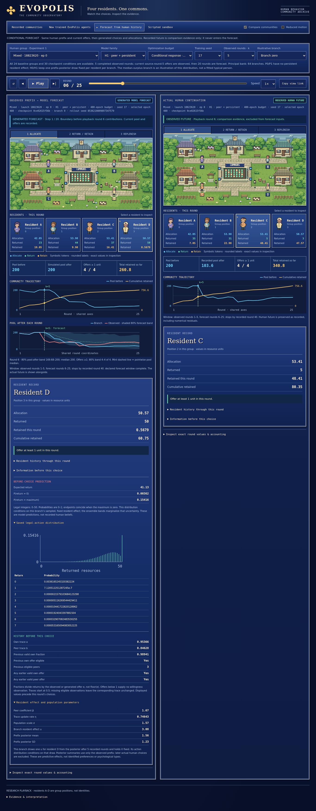

# Conditional responses and persistent individual differences

**The explicit peer-history response did not improve both predictive targets.** On the 21-group primary cohort, H1−H0 changes individual NLL by **+0.00390 [−0.00103, +0.00921]** and collective endpoint energy by **+0.00174 [−0.00428, +0.00849]**; lower is better. Both intervals include zero, and both point estimates are worse. All fitted peer coefficients are positive, but the declared joint-improvement criterion fails. The independent forecast bank also gives an uncertain H1−H0 effect.

All twelve models completed 480 epochs, all 89,856 forecast branches were generated, and numerical and independent score checks passed. This is an original, theory-informed predictive comparison on the already opened human Experiment 1 split. It finds no demonstrated incremental benefit for this particular peer-history term; it does not reject the original elicited-preference findings or identify a causal explanation of the Task 04 individual/collective prediction gap.



*Paired differences and 95% human-group intervals. Three fitted seeds are averaged within each human group. The second forecast bank is shown separately, not pooled.*

## Theory and what these data can measure

[Fischbacher, Gächter and Fehr (2001)](https://doi.org/10.1016/S0165-1765(01)00394-9) elicited payoff-relevant contribution schedules in a one-shot, four-person linear public good with equal 20-token endowments. [Fischbacher and Gächter (2010)](https://doi.org/10.1257/aer.100.1.541) combined that elicitation with ten randomly rematched rounds and incentivized beliefs. Their simulations separated response schedules, belief updating and heterogeneity; imperfect conditional cooperation could generate decline even with identical responders. This distinction matters: persistent variation is not itself their explanation. The [source receipt](../results/task05/theory_sources.json) identifies the published versions, inspected methods, official instructions and downloaded PDF hashes. No source code, schedules or belief estimates were copied.

| Source concept | Task 05 operationalization | Predicted direction | Observable evidence | Identification limit |
| :--- | :--- | :--- | :--- | :--- |
| Elicited conditional contributions (2001; 2010) | Signed log-tilt coefficient β multiplying a trace of peers' earlier eligible contribution fractions | β > 0; extra term improves predictions | Fitted β for every seed; matched H1−H0 and P1−P0 scores | History is endogenous; no elicited schedule or exogenous peer treatment |
| Imperfect conditional cooperation (2010) | Expected fraction minus peer trace, restricted to feasible matching | Expected fraction < trace on some supported states | Opportunity-conditioned model curves | This is **imperfect history matching**, not preference elicitation; β < 1 is not a matching criterion |
| Incentivized beliefs and updating (2010) | An exponentially updated history trace b | No independent belief claim | Observed actions determine b, with fitted update rate η | No incentivized beliefs were collected; b must not be called a measured belief |
| Preference heterogeneity (2001; 2010) | Independent, mean-zero normal resident effects, persistent within a game | Predictive direction unspecified | H1−P1 and H0−P0 comparisons; prefix posterior uncertainty | Predictive temporal variation does not identify preferences, types or demographics |

The underlying game differs from the source public-good experiments. Opportunities are unequal and depend on prior contributions. Before the resource cap, one extra unit returned increases one's next allocation by 0.35 under Equal, 0.875 under Mixed and 1.4 under Proportional when the other returns remain fixed. A positive contribution can therefore reflect an investment incentive. Current allocations also convey previous behavior, so the two baselines without an explicit peer-history term still contain indirect social information. These fitted contrasts identify neither altruism, trust, reciprocity nor a causal institutional effect.

## Matched models and fitting procedure

All four families use the same affine common head and Task 03 zero/maximum-inflated beta-binomial emission. The extra term exponentially tilts the exact integer support 0…floor(e), using fraction c/e rather than c/floor(e). An offer below one forces zero and supplies no evidence of willingness.

For eligible offers, the normalized response is

```text
P(c | z, b, e, u) ∝ pθ(c | z, e) × exp([β(b − 0.5) + u] × c/e),
c = 0, …, floor(e).
```

The normalizer sums over that exact support in log space. When floor(e) = 0, the model returns the exact point mass at zero without dividing by the offer. Setting β and σ to zero recovers P0.

| Family | Extra peer trace | Persistent resident effect |
| :--- | :--- | :--- |
| P0 | β = 0 | σ = 0 |
| P1 | Fitted signed β | σ = 0 |
| H0 | β = 0 | u ∼ Normal(0, σ²) |
| H1 | Fitted signed β | u ∼ Normal(0, σ²) |

The common controls are exactly the intercept, own current offer, three sorted peer offers, current pool, own trace, immediately preceding valid fraction and its validity indicator, previous eligible-peer count, and indicators of any prior own and peer exposure. Offers and pool are divided by 200; peer count is divided by three. Both traces start at 0.5. After all four simultaneous choices resolve, a shared fitted η updates the own trace toward c/e and the peer trace toward the mean of eligible peers. No eligible observation means carrying the trace forward. Institution, identity, current actions, future observations and ending time never enter the head.

For fixed opportunity, common controls and latent effect, the derivative of the expected fraction with respect to b is β Var(C/e). For a posterior mixture with weights held fixed, it is β times the posterior-weighted **within-effect** variance. It is not β times the total mixture variance. Thus the sign of β determines the model's local response direction. This mathematical implication is not an identified human causal effect.

Training uses 96 complete groups, validation 32 and final descriptive evaluation 32, preserving the existing group split. Each family has seeds 17, 29 and 43, and every fit completed 480 epochs. Adam uses learning rate 0.001, weight decay 0.0001, clipping 1.0 and effective batches of eight complete groups, accumulating one complete group at a time. Computation uses float64, one CPU thread and no data workers. After `torch.manual_seed(seed)`, the 5×12 head draws PyTorch's linear-layer uniform initialization on [−1/√12, +1/√12]; the explicit intercept column means there is no extra bias. Matched families start with identical head weights. Raw η and β start at zero; σ starts at 0.5 through its uncapped softplus parameterization. P0/P1/H0/H1 have 61/62/62/63 trainable parameters. The independent PCG64 shuffle stream uses the same optimization seed. The [frozen configuration](../configs/task05.json) and checkpoint receipts retain these settings. Earliest minimum validation group-balanced nonforced NLL selects each model; simulated cooperation and test collective scores do not select models.

Persistent families integrate one latent effect over the resident's **whole sequence**. Gauss–Hermite nodes are numerical points approximating a continuous normal effect distribution; they are not human types or additional empirical observations. Resident log likelihoods sum within a group and divide by that group's nonforced-choice count; group losses then receive equal weight. This is different from drawing a new effect every round. Evaluation performs the equivalent prequential update: predict from the preceding history and posterior, then update from that resident's recorded choice. These posterior updates and deterministic trace updates do not change population weights and are not online parameter learning.

```text
L_i = ∫ Normal(u; 0, σ²) × ∏t P(c_i,t | preceding history, current offers, u) du
group loss = −Σi log(L_i) / number of nonforced choices in that group.
```

### Completed fits and remaining optimization uncertainty

The [completion receipt](../results/task05/training_complete.json) records twelve completed fits. No training or validation group lacked nonforced choices. All peer-response estimates are positive: P1 β ranges from 1.685 to 1.818 and H1 from 1.659 to 1.734. Persistent scales are 1.622–1.655 for H0 and 1.544–1.579 for H1. These are fitted log-tilt scales, not behavioral categories or effect sizes on the contribution-fraction scale.

| Family / seed | Selected epoch | Validation NLL | β | η | σ | Validation change, epochs 440→480 |
| :--- | ---: | ---: | ---: | ---: | ---: | ---: |
| P0 / 17 | 480 | 2.58892 | 0 | 0.5285 | 0 | −0.00545 |
| P0 / 29 | 480 | 2.57977 | 0 | 0.5094 | 0 | −0.00412 |
| P0 / 43 | 480 | 2.57992 | 0 | 0.4591 | 0 | −0.00443 |
| P1 / 17 | 480 | 2.58408 | 1.6849 | 0.5595 | 0 | −0.00533 |
| P1 / 29 | 480 | 2.57565 | 1.7589 | 0.5484 | 0 | −0.00399 |
| P1 / 43 | 480 | 2.57570 | 1.8180 | 0.5059 | 0 | −0.00434 |
| H0 / 17 | 480 | 2.57198 | 0 | 0.7161 | 1.6437 | −0.00350 |
| H0 / 29 | 479 | 2.56579 | 0 | 0.7373 | 1.6553 | −0.00226 |
| H0 / 43 | 480 | 2.56578 | 0 | 0.6813 | 1.6219 | −0.00284 |
| H1 / 17 | 480 | 2.57074 | 1.6652 | 0.7464 | 1.5710 | −0.00344 |
| H1 / 29 | 479 | 2.56460 | 1.6590 | 0.7655 | 1.5790 | −0.00220 |
| H1 / 43 | 480 | 2.56470 | 1.7338 | 0.7256 | 1.5442 | −0.00281 |

Parameters and validation NLL describe the selected checkpoint; the final column compares the actual epoch-440 and epoch-480 validation losses. Every fit improved over those last 40 epochs, and the selected minima are at epochs 479 or 480. The assigned budget therefore does **not** establish convergence. Persistent σ changed by less than 0.006 over the final 40 epochs and is not pressed against an imposed upper cap; nevertheless, its fitted magnitude made numerical integration consequential. The fitted trace rates also differ across families, so these are comparisons between fitted procedures rather than isolated coefficient substitutions.

Before Torch import, available RAM was 454,340 KiB, all 1 GiB of swap was occupied, and disk space was ample. This motivated one-group microbatches and sequential numerical work. The twelve retained fits required **8,581.8 seconds** of summed elapsed fit time and **8,684.1 CPU seconds**, with peak process RSS **357.5 MiB**. The archived unsuccessful numerical-resolution attempts add **943.3 elapsed seconds**: the first H0/17 fit and 18 completed H0/29 epochs. Together these recorded fitting attempts cost **9,525.1 elapsed seconds** (158.8 minutes), before integration checks, evaluation and plotting. These are local measurements, not a claim about total research effort or comparative large-model compute.



*Solid lines show validation NLL; dashed lines show training NLL. Colors identify the three starts. The measured late-epoch improvement prevents a convergence claim.*

### A numerical correction before test scoring

The initially prescribed 21-point Gauss–Hermite rule was not accurate enough for the first completed persistent fit. Across all 128 training/validation groups, the selected H0/17 model changed by as much as **0.010113 in a predicted contribution fraction** and **0.001009 nats per nonforced choice for a resident** when recomputed with 41 nodes. Both exceed the frozen 0.001 tolerance. Its maximum group NLL change was only 0.000373: examining just an aggregate likelihood would have missed the problem. The largest upper-tail probability change was 0.010619.

On that same development-only model, 41 versus 81 nodes reduced the maximum group NLL, resident NLL and predicted-fraction differences to **0.00000336**, **0.00003735** and **0.00022887**; the maximum tail change was 0.00024031. This justified moving persistent training to 41 nodes, refitting H0/17 and restarting the partial H0/29 run from their declared initializations. The six P fits have no latent integral and were preserved. The [dated correction receipt](../results/task05/numerical_correction_01/receipt.json) retains original configurations, source versions and affected checkpoints. This is a repair to numerical integration, not a response to a favorable or unfavorable test result.

The correction also removes repeated evaluation of the same node-independent base emission during prequential inference. On the checked development groups, old and optimized implementations produced exactly the same PMFs, log probabilities and posterior weights. This changes computation cost, not the likelihood or model family. The discarded 480-epoch H0/17 fit and 18 completed H0/29 epochs remain archived and contribute to the reported compute cost.

**All six final persistent checkpoints passed the development-only 41-versus-81-node gate before test scoring.** The [final integration receipt](../results/task05/integration_checks.json) contains all 768 checkpoint/group comparisons, resident-level maxima and representative prefix summaries. Across those checks, the largest group NLL change was 0.00000338 nats per nonforced choice, resident NLL change 0.00003738, predicted-fraction change 0.00026071, and upper-tail probability change 0.00027375. All are below the fixed 0.001 tolerance. Maximum posterior normalization error was 1.78×10⁻¹⁵. The most concentrated inspected posterior had standard deviation about 0.494, compared with its population σ of 1.571. These direct comparisons support the chosen resolution for these fitted models; the node count alone does not establish accuracy for arbitrary future models or populations.

## Evaluation contract

The primary H1−H0 comparison has two required outcomes on the same 21 origin-eligible baseline groups: five Equal, eight Mixed and eight Proportional. Eligibility uses at least one recorded offer ≥ 1 at origin k = 5 and never uses subsequent survival.

1. Individual nonforced prequential NLL in source rounds 5–14. Rounds 0–4 warm the posterior and history; each scored choice is predicted before its observation updates the model.
2. Joint endpoint energy on pool after source round 14 / 200 and all four residents' cumulative private surplus during rounds 5–14 / 2000. Simulations start at the observed boundary and generate the entire future freely.

Each fitted seed is scored separately. Scores average over choices within group, seeds within group, groups within mechanism and mechanisms equally. The 2,000 PCG64 paired group bootstrap replicates use seed 20261022 and the same sampled keys for every family, seed and outcome. Intervals describe human-group sampling uncertainty conditional on these fitted models and numerical banks. Neither seeds nor branches add independent human observations.

**Joint predictive improvement requires both primary 95% intervals below zero.** A conditional-cooperation interpretation additionally requires a positive fitted peer response. An improvement with negative β supports a different conditional association. A null result does not reject the original elicited-preference evidence or all possible conditional-cooperation models.

The principal bank has 73,728 branches: twelve selected fits, 24 baseline groups, origins 0/5/10/20 and 64 branches per cell, with horizons up to 20. A separate 16,128-branch bank repeats only the 21-group primary forecast. The total is 89,856 computational branches. The principal bank determines the primary result; banks are neither pooled nor exchanged after observing their scores. A resident effect is drawn once from its prefix posterior and stays fixed throughout a branch. Future allocations use the existing executable mechanism; first-round recorded allocations and their unallocated residue are preserved.

Proper scores retain Task 04's off-diagonal energy/CRPS estimators, fixed physical normalizations and unclipped values. Pool and surplus marginals, nominal 80% interval coverage, secondary horizons and temporally ordered paths accompany the endpoint result. A joint endpoint score is not a joint path score. Frozen original and continued Task 04 neural procedures supply reference forecasts; their older nine-input representation makes this comparison informative but not information-matched. M1 contributes only recorded-choice likelihood because its executable allocation policy is unavailable.

The resource transition remains the published equation with capacity 200, multiplier 1.4 and exact-zero absorption. Flow variables are padded with zero after depletion while cumulative surplus remains constant. As [earlier numerical audits](protocol.md#what-the-recorded-transitions-actually-show) established, the released records include small residuals and an apparent pool floor near 0.01. Recorded human targets remain unmodified. Coverage can therefore fail when a forecast collapses at zero despite a tiny pool error; this is not evidence of exact reconstruction of the unreleased upstream simulator.

## Matched collective outcomes and Monte Carlo stability

The principal bank supplies the declared result. Every matched primary NLL and energy interval includes zero; neither the peer term nor persistent variation establishes joint predictive improvement at this origin and horizon.

| Contrast | Individual NLL difference; 95% interval | Endpoint energy difference; 95% interval | Independent-bank energy difference; 95% interval |
| :--- | :--- | :--- | :--- |
| H1−H0 | +0.00390 [−0.00103, +0.00921] | +0.00174 [−0.00428, +0.00849] | +0.00025 [−0.01020, +0.01218] |
| P1−P0 | +0.00268 [−0.00355, +0.00889] | −0.00336 [−0.01362, +0.00806] | +0.00862 [+0.00106, +0.01766] |
| H1−P1 | −0.00208 [−0.01215, +0.00806] | −0.00403 [−0.02100, +0.01167] | −0.01014 [−0.02466, +0.00267] |
| H0−P0 | −0.00330 [−0.01519, +0.00836] | −0.00913 [−0.02903, +0.00834] | −0.00177 [−0.02082, +0.01544] |

The second-bank H1−H0 energy result remains uncertain. P1−P0 is less stable: its principal-bank point estimate favors P1 but spans zero, whereas its independent-bank estimate is **worse**, +0.00862 [+0.00106, +0.01766]. H1−H0 seed differences in energy are +0.00009/+0.00078/+0.00434 in the principal bank but +0.00728/−0.00450/−0.00203 in the second. Sixty-four branches per checkpoint/group leave material Monte Carlo variation in small contrasts. The human-group intervals condition on these finite banks; the banks must not be pooled or exchanged to obtain a preferred answer. Family-keyed indexed inverse-CDF draws are independent across families, with separate latent and action streams; no variance-reduction benefit from common random numbers is claimed.

### Absolute scores, marginals and every fitted seed

These primary scores use the same 21 groups and source rounds 5–14. Pool and surplus CRPS use pool/200 and cumulative surplus/2000; trajectory CRPS averages the temporally ordered pool marginals and is not a joint path score. Coverage is the group/mechanism-weighted percentage of human endpoints inside the nominal 80% interval.

| Procedure | NLL | Energy | Pool CRPS | Surplus CRPS | Pool coverage | Surplus coverage | Path pool CRPS |
| :--- | ---: | ---: | ---: | ---: | ---: | ---: | ---: |
| P0 | 1.97511 | 0.10721 | 0.10549 | 0.00961 | 59.4% | 83.6% | 0.07377 |
| P1 | 1.97779 | 0.10385 | 0.10219 | 0.00925 | 64.4% | 86.4% | 0.06978 |
| H0 | 1.97181 | 0.09809 | 0.09643 | 0.00936 | 61.7% | 82.8% | 0.06984 |
| H1 | 1.97571 | 0.09982 | 0.09821 | 0.00917 | 60.8% | 85.0% | 0.06964 |
| Original feedforward | 2.10210 | 0.16271 | 0.16134 | 0.01523 | 37.2% | 60.3% | 0.11329 |
| Continued feedforward | 2.07176 | 0.15708 | 0.15567 | 0.01447 | 43.6% | 63.1% | 0.11082 |
| Original GRU | 2.04385 | 0.09660 | 0.09518 | 0.00846 | 48.3% | 80.8% | 0.07050 |
| Continued GRU | 2.00427 | 0.12538 | 0.12422 | 0.00911 | 40.0% | 90.3% | 0.08538 |

H1−H0 pool CRPS is +0.00178 [−0.00428, +0.00854], surplus CRPS −0.00020 [−0.00080, +0.00037], and path pool CRPS −0.00019 [−0.00390, +0.00373]. The pool coordinate contributes much more than surplus to the joint score at these fixed normalizations. Nominal 80% pool coverage is only 59.4–64.4% across the four families; surplus coverage is 82.8–86.4%. The secondary bank's favorable H1−H0 surplus interval does not replace its uncertain joint endpoint result. Neither near-equal absolute scores nor comparisons with the neural references establish equivalence or an information-matched architecture advantage.

The following exposes all twelve selected fits rather than retaining a favorable seed. Every row averages groups within mechanisms equally; the full-game column additionally includes M1.

| Family / seed | Primary-window NLL | Principal energy | Independent-bank energy | Full-game NLL; 32 groups |
| :--- | ---: | ---: | ---: | ---: |
| P0 / 17 | 1.97353 | 0.10452 | 0.09920 | 2.62703 |
| P0 / 29 | 1.97757 | 0.11277 | 0.10480 | 2.62412 |
| P0 / 43 | 1.97423 | 0.10435 | 0.10550 | 2.62332 |
| P1 / 17 | 1.97654 | 0.10361 | 0.11673 | 2.62691 |
| P1 / 29 | 1.98025 | 0.10298 | 0.10956 | 2.62434 |
| P1 / 43 | 1.97656 | 0.10497 | 0.10907 | 2.62336 |
| H0 / 17 | 1.96979 | 0.10117 | 0.09576 | 2.61597 |
| H0 / 29 | 1.97390 | 0.09878 | 0.10492 | 2.61534 |
| H0 / 43 | 1.97174 | 0.09431 | 0.10350 | 2.61450 |
| H1 / 17 | 1.97388 | 0.10126 | 0.10304 | 2.61869 |
| H1 / 29 | 1.97775 | 0.09956 | 0.10042 | 2.61805 |
| H1 / 43 | 1.97549 | 0.09865 | 0.10148 | 2.61733 |

By mechanism, primary H1−H0 energy changes by +0.00144 in Equal, −0.00714 in Mixed and +0.01091 in Proportional. Those opposing descriptive changes do not support a universal benefit. Complete absolute scores, all four contrasts, mechanism strata, per-seed values, marginal intervals and both banks are in the [forecast summary](../results/task05/forecast_summary.json), with [principal paired group records](../results/task05/primary_paired_groups.csv), [second-bank records](../results/task05/second_bank_paired_groups.csv) and [all new forecast score rows](../results/task05/forecast_scores.csv).

### Secondary origins, horizons and observed paths

The table gives H1−H0 endpoint energy at every declared origin/horizon for both the full baseline cohort and the origin-eligible subset. These secondary intervals are unadjusted across many comparisons. Full-cohort aggregation always weights Equal/Mixed/Proportional equally. At origin 20 there are no eligible Equal groups: the eligible-column estimand then weights **Mixed and Proportional only**, not the original three mechanisms.

| Origin k | Horizon h | Eligible groups; Equal/Mixed/Proportional | All 24 baseline groups; difference [95% interval] | Origin-eligible groups; difference [95% interval] |
| ---: | ---: | :---: | :--- | :--- |
| 0 | 1 | 8/8/8 | −0.00402 [−0.00979, +0.00184] | −0.00402 [−0.00979, +0.00184] |
| 0 | 5 | 8/8/8 | +0.00361 [−0.00216, +0.00940] | +0.00361 [−0.00216, +0.00940] |
| 0 | 10 | 8/8/8 | +0.00660 [−0.00035, +0.01430] | +0.00660 [−0.00035, +0.01430] |
| 0 | 20 | 8/8/8 | +0.01074 [+0.00242, +0.01830] | +0.01074 [+0.00242, +0.01830] |
| 5 | 1 | 5/8/8 | +0.00056 [−0.00193, +0.00366] | +0.00034 [−0.00238, +0.00354] |
| 5 | 5 | 5/8/8 | −0.00227 [−0.00714, +0.00251] | −0.00215 [−0.00699, +0.00259] |
| 5 | 10 | 5/8/8 | +0.00156 [−0.00432, +0.00821] | +0.00174 [−0.00428, +0.00849] |
| 5 | 20 | 5/8/8 | −0.00019 [−0.00651, +0.00639] | −0.00014 [−0.00622, +0.00645] |
| 10 | 1 | 2/7/7 | −0.00059 [−0.00183, +0.00052] | −0.00069 [−0.00212, +0.00059] |
| 10 | 5 | 2/7/7 | +0.00282 [−0.00122, +0.00665] | +0.00345 [−0.00153, +0.00817] |
| 10 | 10 | 2/7/7 | −0.00079 [−0.00732, +0.00549] | −0.00082 [−0.00854, +0.00642] |
| 10 | 20 | 2/7/7 | +0.00508 [−0.00399, +0.01579] | +0.00583 [−0.00427, +0.01820] |
| 20 | 1 | 0/6/7 | −0.00049 [−0.00278, +0.00144] | −0.00093 [−0.00534, +0.00260] |
| 20 | 5 | 0/6/7 | +0.00299 [−0.00091, +0.00775] | +0.00528 [−0.00197, +0.01278] |
| 20 | 10 | 0/6/7 | +0.00667 [−0.00367, +0.01826] | +0.01138 [−0.00777, +0.03127] |
| 20 | 20 | 0/6/7 | +0.01826 [+0.00182, +0.03766] | +0.03151 [+0.00362, +0.06512] |

H1 deteriorates relative to H0 at the 20-round horizon from origin zero and from origin 20; it has no below-zero energy interval at any declared origin/horizon. Other secondary factorial results vary: P1−P0 worsens at k=0/h=1 but improves at k=5/h=5, while persistent families worsen at k=0/h=20 and improve at k=10/h=10 relative to their nonpersistent counterparts in the eligible subsets. These are horizon-specific descriptive findings, not replacements for the primary decision. The full [secondary summaries](../results/task05/forecast_summary.json) retain every family's absolute score, every factorial contrast, pool/surplus marginals, coverage and path-marginal score in both populations.



*First eligible test group by source index in each baseline rule; seed 17, all four families, 64 branches each. Lines are medians and shading is pointwise 10th–90th percentiles. These are temporally ordered trajectories, not joint path confidence regions.*

The selected Proportional case is a visible failure: its human pool recovers while most forecast medians collapse; wide upper bands do not rescue the median trajectory. In the Mixed case, persistent models maintain more resources than nonpersistent models, but this selected-by-source-order illustration does not identify why the aggregate matched intervals remain uncertain. Equal collapses in both human and modeled paths. [Case identities](../results/task05/illustrated_cases.json) preserve the outcome-independent selection rule.

## Individual choices and recorded-state checks

The primary individual window contains **555 nonforced choices in the same 21 groups**, with no zero-choice group or window. H1−H0 NLL is **+0.00390 [−0.00103, +0.00921]**: the peer term has a slightly worse point estimate, and the interval includes zero. All three optimization starts have positive differences (+0.00409, +0.00385 and +0.00375), but these starts do not provide three independent human samples. P1−P0 is +0.00268 [−0.00355, +0.00889]; the two persistence contrasts also span zero. These individual results do not satisfy the individual part of the joint-improvement criterion.

Whole-game individual scores retain all 32 groups, including the eight M1 groups. Recorded-state collective checks use the 24 baseline groups, averaging over rounds with at least one eligible resident. The following are absolute scores, averaged across the three selected starts; lower is better in every score column.

| Fitted procedure | Full-game individual NLL; 32 groups | One-step total-return NLL; 24 groups | Renewal Brier; 24 groups |
| :--- | ---: | ---: | ---: |
| P0 | 2.62482 | 3.33824 | 0.12677 |
| P1 | 2.62487 | 3.33166 | 0.12731 |
| H0 | 2.61527 | 3.32493 | 0.12757 |
| H1 | 2.61802 | 3.32748 | 0.12836 |
| Original feedforward reference | 2.72379 | 3.58010 | 0.15918 |
| Continued feedforward reference | 2.68905 | 3.54590 | 0.15843 |
| Original GRU reference | 2.69439 | 3.36439 | 0.12930 |
| Continued GRU reference | 2.61894 | 3.30844 | 0.13801 |

For whole-game NLL, the four matched contrasts are H1−H0 +0.00275 [−0.00005, +0.00562], P1−P0 +0.00005 [−0.00441, +0.00442], H1−P1 −0.00685 [−0.01612, +0.00282], and H0−P0 −0.00955 [−0.01979, +0.00119]. All include zero. H0 has the lowest new-family point estimate, but this does not establish a general ranking. Frozen neural likelihoods agree with their Task 04 values to 2.22×10⁻¹⁵; their different information set prevents an architecture-only interpretation.

Adding the peer term within the persistent family also gives no clear recorded-state collective improvement: H1−H0 total-return NLL is +0.00256 [−0.00592, +0.01046], and renewal Brier changes by +0.00080 [−0.00100, +0.00274]. All other matched one-step NLL and Brier intervals span zero. Mean predicted renewal probabilities for P0/P1/H0/H1 are 0.3299/0.3357/0.3350/0.3378, compared with observed 0.3698 under the same group weighting. Fixed-bin calibration therefore accompanies proper scores; a global mean alone is not a calibration test. Exact convolution assumes conditional resident independence and cannot determine whether unexplained contemporaneous dependence causes a multiround forecast error.

The [observation summaries](../results/task05/one_step_summary.json), [individual group scores](../results/task05/individual_groups.csv), [primary-window scores](../results/task05/individual_primary_window.csv), [one-step group scores](../results/task05/collective_one_step_groups.csv) and [calibration bins](../results/task05/collective_calibration_bins.csv) preserve every seed and mechanism rather than selecting a favorable start.



*Fixed probability bins, equal group/mechanism weighting. Bin counts and masses are retained in the CSV; sparse extreme bins are not independent human samples.*

## Descriptive mechanism checks

Response curves hold observed resources, own history and prefix posterior weights fixed. Illustrations use seed 17, the first source-index eligible **training** group within each baseline rule at origin five, and its first eligible resident. The proximity rug requires identical discrete validity/exposure controls and RMS distance at most 0.5 across standardized continuous controls; the solid interval is the neighboring training b distribution's central 90%. Other portions are model extrapolation. Nearby observations indicate descriptive support, not causal identification.

A fixed linear projection checks whether b adds much variation beyond the common controls. For each selected model's fitted trace rate, weighted least squares fits b on the exact common z using training observations only; every interacting group has total weight one. Those coefficients then remain fixed on validation. Residual variation and coefficient stability across optimization seeds describe redundancy; this regression neither adjusts a causal effect nor becomes another behavioral candidate.

Expected fraction minus b is displayed only where e ≥ 1 and b ≤ floor(e)/e. This excludes mechanically impossible matching and distinguishes opportunity constraints from fitted imperfect history matching. Prefix-posterior summaries report uncertainty and shrinkage relative to the population distribution without assigning psychological types. One-step total-return likelihood and renewal calibration convolve resident posterior-predictive PMFs under the model's conditional independence assumption; their computation does not establish that assumption empirically.

### Measured response support, redundancy and posterior uncertainty

The peer trace retains substantial variation after the declared linear projection. Across all twelve fits, training R² is 0.275–0.318 and transported validation R² is 0.318–0.362. Residual standard deviations are 0.141–0.178 in training and 0.131–0.169 in validation. Thus this particular diagnostic does **not** support explaining the null by nearly complete linear redundancy with the common controls. It does not remove nonlinear redundancy, endogenous opportunity, correlated histories or uncertainty from a small test cohort. The observed design has rank 11 for 12 columns; the minimum-norm projection is descriptive, and its collinear coefficients are not uniquely interpretable.

| Family; range over starts | Training b SD | Training residual SD | Validation b SD | Validation residual SD |
| :--- | :--- | :--- | :--- | :--- |
| P0 | 0.170–0.180 | 0.141–0.149 | 0.165–0.174 | 0.131–0.140 |
| P1 | 0.177–0.184 | 0.147–0.153 | 0.171–0.179 | 0.137–0.143 |
| H0 | 0.199–0.206 | 0.168–0.175 | 0.195–0.202 | 0.158–0.165 |
| H1 | 0.205–0.210 | 0.173–0.178 | 0.200–0.206 | 0.164–0.169 |



For H1/17, the source-order Equal, Mixed and Proportional training cases have offers 4.90, 43.575 and 35.00. Their descriptive neighborhoods contain 860, 565 and 36 choices, respectively, with central peer-trace support approximately 0.297–0.778, 0.475–0.850 and 0.647–0.869. These are repeated choices, not independent groups; the Proportional support is especially sparse. On the supported plotting grid, expected H1 fractions rise only from about 0.620 to 0.663, 0.630 to 0.660 and 0.631 to 0.651 as b varies over those intervals. Positive β therefore does not imply one-for-one matching.

Within the feasible supported range, the Equal and Mixed illustrations contain both over- and under-matching. The Proportional H1 illustration stays below b by approximately 0.019–0.209. This is fitted **imperfect history matching**, not evidence of elicited preferences or biased beliefs. The solid curve segments, rather than extrapolated dotted portions, define the cited ranges. Common controls and posterior weights remain fixed within each curve; fitted η means the reconstructed traces need not be identical between families.

Five observed rounds narrow the example resident-effect posteriors but leave substantial uncertainty. The cases below are the same outcome-independent training cases used for the curves, resident zero, seed 17. Means are on the log-tilt scale; the final column measures remaining posterior spread relative to the fitted normal population prior.

| Family / case | Posterior mean | Posterior SD | Posterior SD / prior SD |
| :--- | ---: | ---: | ---: |
| H0 / Equal | 1.126 | 1.198 | 0.729 |
| H0 / Mixed | 1.676 | 1.281 | 0.779 |
| H0 / Proportional | 0.753 | 1.231 | 0.749 |
| H1 / Equal | 1.120 | 1.166 | 0.742 |
| H1 / Mixed | 1.517 | 1.248 | 0.795 |
| H1 / Proportional | 0.678 | 1.201 | 0.765 |

Posterior SD remains approximately 73–80% of prior SD. A positive posterior mean predicts relatively larger contributions conditional on the model's controls; it does not identify a stable cooperative personality. Complete training projection coefficients, support rugs, response derivatives and posterior nodes/weights are preserved in the [mechanism diagnostics](../results/task05/mechanism_diagnostics.json), and every selected β/η/σ and checkpoint identity is in the [parameter table](../results/task05/parameters.csv).

## Verification, artifacts and reproduction

The [complete forecast archive](../results/task05/forecasts.sqlite3) is 96,071,680 bytes (91.62 MiB), containing all 1,404 forecast cells and 89,856 branches. It retains contributions, allocations, resident effects, pool and surplus paths, padding, identities and draw seeds; selected illustrative branches also retain full before-choice PMFs and histories. Global weights remain frozen. The archive, [seed table](../results/task05/forecast_seeds.json), selected/resumable checkpoints, [frozen forecast identity](../results/task05/forecast_frozen.json) and source/split hashes make individual branches reproducible without treating simulated draws as new people.

The [forecast verification](../results/task05/forecast_verification.json) checked legal actions, resource transitions and persistent resident effects throughout all 89,856 branches. A fresh process exactly regenerated all 64 branches for H1/17, Mixed group launch 18823620, origin five. The [generation receipt](../results/task05/forecast_generation.json) records zero maximum legal-support violation, zero allocation overshoot and zero transition residual, across 958,755 executed and 677,085 padded rounds.

An [independent audit](../results/task05/independent_score_audit.json), importing neither Torch nor EvoPolis, reconstructed raw Experiment 1 targets, proper scores and paired full-key bootstrap contrasts. All raw-source arrays and observed endpoints agreed exactly; maximum energy disagreement was 2.22×10⁻¹⁶, individual NLL disagreement 1.33×10⁻¹⁵ and contrast-interval disagreement 5.83×10⁻¹⁶. It verified 158 protected earlier scientific files byte for byte and all twelve completed fits. Reserved experiment outcomes were not parsed. The protected P checkpoints remained identical through the documented integration correction.

Eleven focused tests passed for exact legal PMFs at forced/small/ordinary offers, zero-parameter reductions, signed derivatives, marginal-versus-prequential likelihood, future-target poisoning, simultaneous histories, persistent latent draws, group weighting, shared bootstrap keys, exact checkpoint resume, checkpoint-specific integration receipts and faithful viewer branch data. The [full existing suite](../results/task05/all-tests.txt) also passed all 61 tests (12.398 seconds of test time); the [focused log](../results/task05/focused-tests.txt) preserves the eleven Task 05 checks. These checks validate consequential behavior; their number does not measure scientific support for the mechanism.

The sequential command timings below come from the [execution receipt](../results/task05/execution.json); peak process RSS comes from the corresponding measured phase receipt. Command elapsed time includes startup and can exceed the inner timed computation. Browser memory and human analysis time are not included.

| Phase after fitting | Command elapsed seconds | Peak process RSS |
| :--- | ---: | ---: |
| Final development integration gate | 169.9 | 312.5 MiB |
| Recorded-choice and one-step evaluation | 52.3 | 317.1 MiB |
| Both forecast banks | 701.9 | 331.0 MiB |
| Forecast scoring | 17.3 | 77.0 MiB |
| Fresh regeneration and archive verification | 41.7 | Not separately recorded |
| Mechanism diagnostics | 11.2 | 448.1 MiB |
| Five PNG/SVG scientific figures | 5.0 | Not separately recorded |
| Independent score/source audit | 17.0 | 89.8 MiB |
| Full existing tests | 18.6 | Not separately recorded |

The SVG versions beside each PNG preserve editable chart geometry and the existing blue-panel research theme. The earlier experimental figures and FFV-inspired town remain in place. The existing [community viewer](viewer.md#conditional-responses-and-resident-differences) exposes all four Task 05 families, all selected seeds, every principal origin and branch-zero/median illustrations, alongside earlier replay and forecast modes. Its resident inspector distinguishes branch-effect-conditioned PMFs from ensemble uncertainty, and traces from beliefs.

The [actual Chromium verification](../results/task05/browser-verification.json) passed 26 interaction flows across recorded replay, sandbox, trained agents, earlier forecasts and the new conditional families. It checked native keyboard selection, direct-URL restoration and a 390×844 layout without page overflow; browser errors and console logs were empty. The screenshot below shows H1/17, Mixed human group launch 18823620, origin five, branch zero, at playback round six, with Residents D/C selected. Its distribution, history and resident-effect inspector display saved numerical evidence from that branch.



The final [verification summary](../results/task05/verification.json) collects completion evidence, and the [provenance manifest](../results/task05/provenance.json) records hashes of the published scientific artifacts, documentation and viewer evidence. These receipts connect the report to the completed experiment without changing its null primary conclusion.

From the Linux checkout with the locked `uv` environment, use the following commands sequentially. The Task 03 preparation command reconstructs the pinned Experiment 1 arrays and split; the training command resumes saved state and retains completed fits. Generation reuses complete archived cells. Existing selected checkpoints and their hashes remain the published evidence.

```bash
bash scripts/conditional.sh profile
bash scripts/learn.sh prepare
bash scripts/conditional.sh train
bash scripts/conditional.sh integration
bash scripts/conditional.sh prepare
bash scripts/conditional.sh observations
bash scripts/conditional.sh generate
bash scripts/conditional.sh scores
bash scripts/conditional.sh verify
bash scripts/conditional.sh diagnostics
bash scripts/conditional.sh plot
bash scripts/conditional.sh audit
uv run --frozen python -m unittest discover -s tests -v
bash scripts/viewer.sh --port 8765
```

Training can be restricted to a resumable assigned fit, for example `bash scripts/conditional.sh train --family H1 --seed 17`. The [Task 05 specification](tasks/05-conditional-responses.md), [frozen training identity](../results/task05/frozen_training.json), [configuration](../configs/task05.json) and dated numerical-correction archive distinguish planned settings from the measured accuracy repair. Reproducing this experiment does not authorize tuning against the opened test outcomes or accessing reserved transfer evidence.

## Scope of the evidence

Experiment 1 has already been examined in earlier tasks. Fixing this procedure before its new comparisons makes the follow-up disciplined, not independently confirmatory. Experiments 2–3 remain reserved; Experiment 4 is outside scope. Endogenous resources, correlated histories, a small primary cohort and the absence of elicited beliefs or preferences constrain theoretical interpretation despite the fitted positive response direction. The preserved split keeps each interacting group and launch together; the release cannot establish whether participants recur across different group identifiers. Three optimization starts characterize these fitted procedures without representing three independent human populations or all parameter uncertainty.

This experiment fits population parameters, infers resident effects and simulates consequences under fixed allocation rules. It does not optimize institutions, implement evolutionary search or demonstrate recursive self-improvement. A later task should freeze a selected procedure before evaluating a reserved cohort; differences in instructions and allocations constitute a joint distribution shift.
